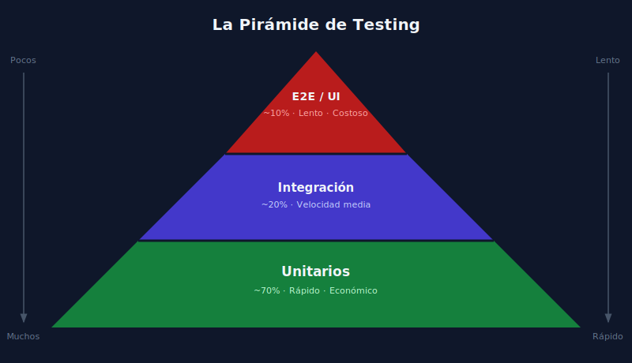

# 02 — Pirámide de Testing y Niveles de Prueba

> **Semana 01 · Etapa 0: Fundamentos** | Transversal (sin código)

---

## La Pirámide de Testing

La **pirámide de testing** es un modelo visual que guía cuántos tests de cada tipo debe tener un sistema y en qué proporción.



### Lectura de la pirámide

La pirámide se divide en tres niveles. De base a cúspide:

| Nivel | Nombre | Proporción | Velocidad | Costo |
| :---: | --- | :---: | --- | --- |
| Base | Tests unitarios | ~70% | Milisegundos | Bajo |
| Medio | Tests de integración | ~20% | Segundos | Medio |
| Cúspide | Tests E2E / UI | ~10% | Minutos | Alto |

> La regla general: **muchos tests pequeños y rápidos**, pocos tests grandes y lentos.

### ¿Por qué esta forma?

- Los tests **unitarios** son baratos de escribir, rápidos de ejecutar y fáciles de mantener. Se pueden tener cientos o miles.
- Los tests de **integración** son más lentos porque involucran múltiples componentes o servicios reales.
- Los tests **E2E** simulan al usuario final — son valiosos pero frágiles y lentos. Si hay demasiados, el pipeline de CI puede tardar horas.

### El anti-patrón: el cono de helado

Cuando un proyecto tiene más tests E2E que unitarios, se habla del **cono de helado** (o pirámide invertida). Síntomas:

- Los tests tardan 30+ minutos en CI
- Un cambio pequeño rompe decenas de tests E2E
- El equipo deja de ejecutar los tests localmente

---

## Los cuatro niveles de testing

### Nivel 1 — Tests Unitarios

Prueban la **unidad mínima de código** en aislamiento: una función, un método, una clase.

**Características:**
- Sin dependencias externas (BD, red, sistema de archivos)
- Deterministas: siempre el mismo resultado con los mismos inputs
- Rápidos: microsegundos a milisegundos por test
- Escritos por el propio desarrollador

**Ejemplo conceptual:**
Una función `calcularDescuento(precio, porcentaje)` recibe 100 y 20, y debe retornar 80. El test verifica ese contrato, sin importar si hay una BD detrás.

---

### Nivel 2 — Tests de Integración

Prueban la **interacción entre dos o más componentes** del sistema.

**Características:**
- Involucran componentes reales (o casi reales): BD, servicios, APIs
- Más lentos que los unitarios
- Detectan problemas en los "bordes" entre componentes

**Ejemplo conceptual:**
Un test que guarda un usuario en la base de datos y luego lo recupera, verificando que los datos persisten correctamente.

**Subtipos comunes:**
- Tests de repositorio (capa de datos)
- Tests de API (contrato HTTP)
- Tests de integración de servicios externos

---

### Nivel 3 — Tests de Sistema / End-to-End (E2E)

Prueban el **flujo completo** del sistema desde la perspectiva del usuario.

**Características:**
- Simulan acciones reales en la UI (clic, formulario, navegación)
- Involucran todos los componentes: frontend, backend, BD
- Lentos y potencialmente frágiles (dependen de selectores HTML, tiempos de red)
- Herramientas: Playwright, Cypress, Selenium

**Ejemplo conceptual:**
Un test que abre el navegador, navega a la página de login, ingresa credenciales, verifica que redirige al dashboard y que el nombre del usuario aparece en la barra de navegación.

---

### Nivel 4 — Tests de Aceptación

Prueban que el sistema cumple los **criterios de aceptación del negocio**, generalmente escritos en lenguaje natural (Gherkin / BDD).

**Características:**
- Orientados al negocio, no a la técnica
- Escritos en colaboración entre el equipo técnico y el negocio
- Formato: `Given / When / Then` (Gherkin)
- Herramientas: Behave (Python), Cucumber (Java/JS)

**Ejemplo conceptual:**

```
Dado que soy un usuario registrado
Cuando inicio sesión con credenciales válidas
Entonces debo ver mi panel de control
```

---

## Comparativa de los cuatro niveles

| Aspecto | Unitario | Integración | E2E | Aceptación |
| --- | --- | --- | --- | --- |
| ¿Qué prueba? | Una función/clase | Varios componentes | Flujo completo de usuario | Regla de negocio |
| Velocidad | ⚡ Muy rápido | 🔶 Medio | 🐢 Lento | 🐢 Lento |
| Aislamiento | Completo | Parcial | Ninguno | Ninguno |
| Quién los escribe | Desarrollador | Dev / QA | QA / SDET | QA + Negocio |
| Cuando falla | Problema en lógica | Problema en integración | Problema en flujo | Requisito no cumplido |

---

## El principio de la pirámide en la práctica

Una distribución saludable para una aplicación web mediana:

| Tipo | Cantidad orientativa |
| --- | --- |
| Tests unitarios | 300–500 |
| Tests de integración | 50–100 |
| Tests E2E | 20–30 |

> No es una regla fija — depende del tipo de sistema. Un sistema con mucha lógica de negocio tendrá más unitarios; una app con flujos críticos de usuario necesitará más E2E.

---

## Resumen

- La **pirámide de testing** guía la proporción ideal entre tipos de tests.
- Los cuatro niveles son: **unitario → integración → sistema/E2E → aceptación**.
- Más unitarios = más rápido, más barato, más confiable.
- El anti-patrón es el **cono de helado**: muchos E2E, pocos unitarios.
- Cada nivel responde a una pregunta distinta sobre el sistema.

---

**Anterior**: [01 — Calidad y Tipos de Testing](./01-calidad-y-tipos-de-testing.md) | **Siguiente**: [03 — Ciclo de Vida del Bug](./03-ciclo-de-vida-del-bug.md)
