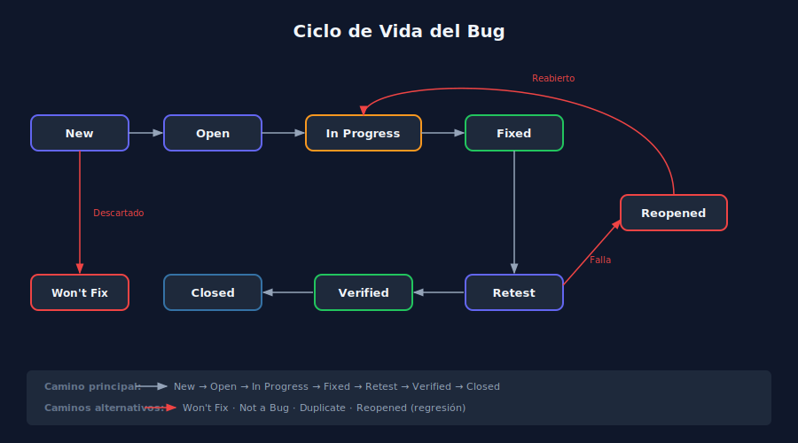

# 03 — Ciclo de Vida del Bug

> **Semana 01 · Etapa 0: Fundamentos** | Transversal (sin código)

---

## Terminología esencial

Antes de ver el ciclo, es importante distinguir tres términos que frecuentemente se confunden:

| Término | Definición | Ejemplo |
| --- | --- | --- |
| **Error** | Acción humana que introduce un defecto | Un desarrollador escribe `precio * 1.1` en lugar de `precio * 0.9` para aplicar un descuento |
| **Defecto / Bug** | El problema en el código (la causa) | La lógica de descuento está invertida en el archivo `PriceCalculator.java` |
| **Failure / Fallo** | El comportamiento incorrecto observable (el efecto) | El sistema cobra 10% más en lugar de descontar 10% |

> Un **error** introduce un **defecto** que produce un **failure** cuando se ejecuta.

---

## ¿Qué es un reporte de bug?

Un **reporte de bug** (bug report) es el documento formal que describe un defecto encontrado en el software. Su propósito es proporcionar toda la información necesaria para que otro desarrollador pueda:

1. **Reproducir** el problema
2. **Entender** cuál es el comportamiento esperado
3. **Priorizar** según su severidad e impacto

### Campos obligatorios de un buen reporte

| Campo | Descripción | Ejemplo |
| --- | --- | --- |
| **Título** | Breve y descriptivo: `[Componente] Descripción` | `[Checkout] El descuento se aplica a la inversa` |
| **Pasos para reproducir** | Numerados, específicos, reproducibles | 1. Ir al carrito. 2. Añadir cupón SAVE10. 3. Verificar total. |
| **Resultado obtenido** | Lo que ocurre actualmente | El precio aumenta un 10% |
| **Resultado esperado** | Lo que debería ocurrir | El precio debe reducirse un 10% |
| **Severidad** | Impacto técnico del defecto | High |
| **Prioridad** | Urgencia de resolución según el negocio | P1 |
| **Entorno** | SO, versión de la app, dispositivo | macOS 14, Chrome 122, app v2.3.1 |
| **Evidencia** | Capturas, logs, videos (si aplica) | screenshot-checkout.png |

---

## Severidad vs Prioridad

Un error común es confundir severidad con prioridad. Son dimensiones distintas:

**Severidad** = impacto técnico en el sistema
**Prioridad** = urgencia de resolución según el negocio

| Severidad | Descripción | Ejemplo |
| --- | --- | --- |
| **Critical** | El sistema no funciona / pérdida de datos | La app se cae al intentar pagar |
| **High** | Funcionalidad principal rota sin workaround | No se pueden crear cuentas nuevas |
| **Medium** | Funcionalidad secundaria afectada | El filtro de búsqueda no ordena bien |
| **Low** | Problema cosmético o mínimo impacto | Typo en el texto del footer |

| Prioridad | Descripción |
| --- | --- |
| **P1** | Resolver hoy / urgente |
| **P2** | Resolver en el sprint actual |
| **P3** | Resolver en los próximos sprints |
| **P4** | Backlog — sin urgencia |

### ¿Pueden divergir?

Sí, y es común:

- **Alta severidad, baja prioridad**: un crash en una función muy poco usada por <0.1% de usuarios.
- **Baja severidad, alta prioridad**: el logo de la empresa aparece distorsionado en la página de inicio (impacto en imagen de marca).

---

## El ciclo de vida de un bug

Un bug no pasa directamente de "encontrado" a "resuelto". Sigue un flujo definido que asegura trazabilidad y calidad en la corrección.



### Estados del ciclo

| Estado | Descripción | ¿Quién actúa? |
| --- | --- | --- |
| **New** | El bug fue reportado y está pendiente de revisión | Tester |
| **Open** | El bug fue revisado y confirmado — está en la cola | QA Lead / PM |
| **In Progress** | El desarrollador está trabajando en la corrección | Desarrollador |
| **Fixed** | El desarrollador aplicó una corrección | Desarrollador |
| **Retest** | El tester verifica que la corrección funciona | Tester |
| **Verified** | La corrección fue validada — el bug está resuelto | Tester |
| **Closed** | El bug se cierra formalmente | QA Lead |
| **Won't Fix** | Se decide no corregir (baja prioridad, duplicado, etc.) | QA Lead / PM |
| **Reopened** | La corrección no funcionó — el bug reaparece | Tester |

### Flujo típico

```
New → Open → In Progress → Fixed → Retest → Verified → Closed
                                              ↓
                                          Reopened → In Progress → ...
```

### Flujos alternativos

- **New → Won't Fix**: el bug es válido pero no se priorizará (feature request disfrazado, baja severidad, fuera del alcance).
- **New → Duplicate**: ya existe un reporte idéntico abierto.
- **New → Not a Bug**: el comportamiento es el esperado — el tester malinterpretó los requisitos.

---

## El ciclo de vida de un bug en la práctica

### Herramientas comunes de seguimiento

| Herramienta | Uso |
| --- | --- |
| **Jira** | Estándar de la industria — proyectos ágiles grandes |
| **GitHub Issues** | Integrado con el repositorio — popular en proyectos open source |
| **Linear** | Moderno, rápido — favorito de startups |
| **Trello** | Simple — equipos pequeños o proyectos no técnicos |
| **Azure DevOps** | Ecosistema Microsoft |

> En este bootcamp usaremos **GitHub Issues** para reportar los bugs del proyecto semanal.

---

## Cómo escribir un título de bug efectivo

El título es lo primero que lee el desarrollador. Debe responder: _¿qué está roto y dónde?_

**Formato recomendado**: `[Componente] Descripción del comportamiento incorrecto`

| ❌ Titulo malo | ✅ Título bueno |
| --- | --- |
| `Bug en login` | `[Login] El botón "Iniciar sesión" no responde en Safari 17` |
| `Error al guardar` | `[Perfil] Al guardar cambios sin foto, el sistema elimina la foto existente` |
| `No funciona el pago` | `[Checkout] La pasarela de pago falla con tarjetas Visa terminadas en 4242` |
| `Problema con el texto` | `[Registro] El mensaje de error de email inválido aparece en inglés cuando el idioma es español` |

---

## Resumen

- **Error → Defecto → Failure**: tres conceptos distintos que forman una cadena causal.
- Un **buen reporte de bug** incluye título, pasos, resultado obtenido, resultado esperado, severidad, prioridad y entorno.
- **Severidad** mide el impacto técnico; **prioridad** mide la urgencia del negocio — pueden divergir.
- El ciclo de vida de un bug: **New → Open → In Progress → Fixed → Retest → Verified → Closed**.
- Los flujos alternativos más importantes: **Won't Fix**, **Duplicate**, **Not a Bug**, **Reopened**.

---

**Anterior**: [02 — Pirámide y Niveles](./02-piramide-y-niveles.md)
