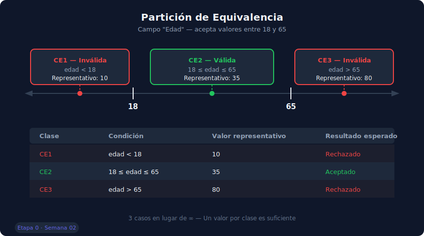
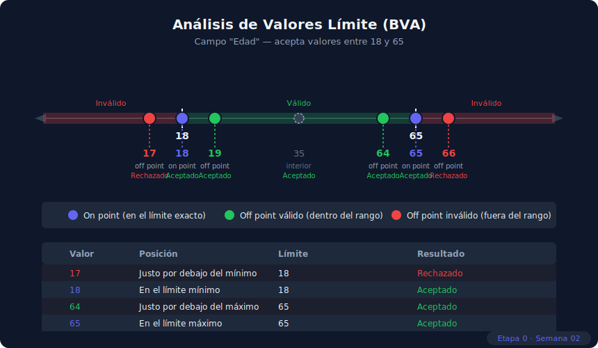

# Técnicas de Diseño — Partición, BVA y Tablas de Decisión

> **Semana 02 — Teoría 02** | Etapa 0: Fundamentos de Testing | Transversal (JS / Python / Java)

---

## El Problema de la Exhaustividad

Probar **todos los valores posibles** de un campo es imposible en la práctica. Un campo de texto con 255 caracteres tiene millones de combinaciones. Un sistema con 10 campos tiene billones.

Las **técnicas de diseño de pruebas** resuelven este problema: permiten seleccionar el **mínimo número de casos** que maximizan la probabilidad de encontrar defectos.

> "El testing exhaustivo es imposible. La selección inteligente de casos es la habilidad clave del tester." — Myers, The Art of Software Testing

---

## Técnica 1: Partición de Equivalencia

### Concepto

La **partición de equivalencia** divide el dominio de entrada de un campo en **clases** donde se asume que todos los valores de una clase se comportan igual. Basta testear **un valor representativo** de cada clase.

Si un test con el valor 5 cubre la misma lógica que con el valor 7, solo necesitamos uno de los dos.

### Cómo aplicarla

1. Identificar todos los campos de entrada de la funcionalidad
2. Para cada campo, definir las **clases válidas** (la aplicación debe aceptarlas) e **inválidas** (la aplicación debe rechazarlas)
3. Seleccionar un valor representativo de cada clase
4. Crear un caso de prueba por clase

### Ejemplo: Campo "Edad" (acepta 18–65)



| Clase | Rango | Valor representativo | Tipo |
|---|---|---|---|
| CE1 | edad < 18 | 10 | Inválida |
| CE2 | 18 ≤ edad ≤ 65 | 35 | Válida |
| CE3 | edad > 65 | 80 | Inválida |

**Resultado**: 3 casos en lugar de infinitos. Un test con edad=35 representa todos los valores entre 18 y 65.

### Ejemplo aplicado a un login

**Campo "Contraseña"** (mínimo 8 caracteres, máximo 50, solo alfanumérica):

| Clase | Condición | Valor rep. | Tipo |
|---|---|---|---|
| CE1 | longitud < 8 | `"abc12"` | Inválida |
| CE2 | 8 ≤ longitud ≤ 50, alfanumérica | `"Pass1234"` | Válida |
| CE3 | longitud > 50 | 51 caracteres | Inválida |
| CE4 | contiene caracteres especiales | `"Pass@123"` | Inválida |
| CE5 | campo vacío | `""` | Inválida |

---

## Técnica 2: Análisis de Valores Límite (BVA)

### Concepto

El **Boundary Value Analysis** (BVA) complementa la partición de equivalencia. Los errores tienden a concentrarse en los **límites** entre clases (off-by-one errors). Por eso, además del valor representativo del interior de cada clase, se testean los valores en la frontera.

### Regla de los 3 valores por límite

Para cada límite, probar:
- El valor **justo en el límite** (on point)
- El valor **justo por debajo** del límite (off point inferior)
- El valor **justo por encima** del límite (off point superior)



### Ejemplo: Campo "Edad" (acepta 18–65)

| Posición | Valor | Resultado esperado |
|---|---|---|
| Justo por debajo del mínimo | 17 | Rechazado |
| **En el límite mínimo** | **18** | **Aceptado** |
| Justo por encima del mínimo | 19 | Aceptado |
| Justo por debajo del máximo | 64 | Aceptado |
| **En el límite máximo** | **65** | **Aceptado** |
| Justo por encima del máximo | 66 | Rechazado |

**Total de casos BVA**: 6 valores en los límites + 1 valor interior = **7 casos** que cubren todos los escenarios críticos.

### BVA en campos de texto (longitud)

**Contraseña** (mínimo 8, máximo 50 caracteres):

```
Límite inferior (8):
  7 caracteres  → Rechazado  (off point inferior)
  8 caracteres  → Aceptado   (on point)
  9 caracteres  → Aceptado   (off point superior)

Límite superior (50):
  49 caracteres → Aceptado   (off point inferior)
  50 caracteres → Aceptado   (on point)
  51 caracteres → Rechazado  (off point superior)
```

---

## Combinando Partición de Equivalencia + BVA

El flujo de trabajo recomendado:

```
1. Aplicar partición de equivalencia
   → Identificar clases válidas e inválidas
   → Un caso por clase (valor representativo del interior)

2. Aplicar BVA en los límites
   → Para cada frontera entre clases: probar on/off points

3. Resultado: cobertura máxima con mínimo de casos
```

Usando el ejemplo de la contraseña, combinando ambas técnicas obtenemos **8 casos** que cubren todos los escenarios relevantes, sin redundancias.

---

## Técnica 3: Tablas de Decisión

### Concepto

Cuando una funcionalidad tiene **múltiples condiciones booleanas** que se combinan para generar distintos resultados, las tablas de decisión evitan el olvido de combinaciones.

### Cuándo usarlas

- Más de 2 condiciones que interactúan entre sí
- Reglas de negocio complejas (descuentos, tarifas, permisos)
- Cada combinación de condiciones produce un resultado diferente

### Estructura

```
Condiciones  | R1 | R2 | R3 | R4
-------------|----|----|----|----|
¿Usuario VIP?|  S |  S |  N |  N |
¿Cupón válido|  S |  N |  S |  N |
-------------|----|----|----|----|
Acciones
Descuento 30%|  X |    |    |    |
Descuento 20%|    |  X |    |    |
Descuento 10%|    |    |  X |    |
Sin descuento|    |    |    |  X |
```

Cada columna (R1, R2…) representa una **regla** que genera un caso de prueba.

### Ejemplo: Sistema de descuentos de una librería

**Condiciones**:
- ¿Es cliente premium? (S/N)
- ¿Compra supera $50? (S/N)
- ¿Tiene cupón activo? (S/N)

**Reglas** (2³ = 8 combinaciones posibles):

| Condición | R1 | R2 | R3 | R4 | R5 | R6 | R7 | R8 |
|---|---|---|---|---|---|---|---|---|
| Cliente premium | S | S | S | S | N | N | N | N |
| Compra > $50 | S | S | N | N | S | S | N | N |
| Cupón activo | S | N | S | N | S | N | S | N |
| **Descuento** | **40%** | **30%** | **25%** | **20%** | **20%** | **10%** | **10%** | **0%** |

Cada columna = un caso de prueba distinto. La tabla garantiza que ninguna combinación fue omitida.

### Simplificación de tablas

Cuando dos reglas producen el mismo resultado sin importar el valor de una condición, se pueden colapsar:

```
R1: premium=S, compra>50=S, cupón=S → 40%
R2: premium=S, compra>50=S, cupón=N → 40%

Simplificado:
R1': premium=S, compra>50=S, cupón=cualquiera → 40%
```

---

## Comparativa de Técnicas

| Técnica | Cuándo usar | Ventaja | Limitación |
|---|---|---|---|
| Partición de equivalencia | Siempre como base | Reduce drásticamente los casos | No detecta errores en los bordes |
| BVA | Campos con rangos o longitudes | Detecta off-by-one errors | Solo aplica donde hay límites numéricos o de longitud |
| Tablas de decisión | Múltiples condiciones booleanas | Garantiza cobertura de combinaciones | Escala exponencialmente con más condiciones |

---

## Resumen del Proceso de Diseño

```
Funcionalidad a testear
        │
        ▼
1. Identificar entradas y salidas
        │
        ▼
2. Aplicar Partición de Equivalencia
   → Clases válidas e inválidas por campo
        │
        ▼
3. Aplicar BVA en campos con rangos
   → On points y off points por límite
        │
        ▼
4. Aplicar Tabla de Decisión si hay múltiples condiciones
        │
        ▼
5. Resultado: suite mínima y completa
```

---

## Próximo tema

→ [Cobertura, Tipos de Test y Herramientas de Gestión](./03-cobertura-y-tipos.md)
