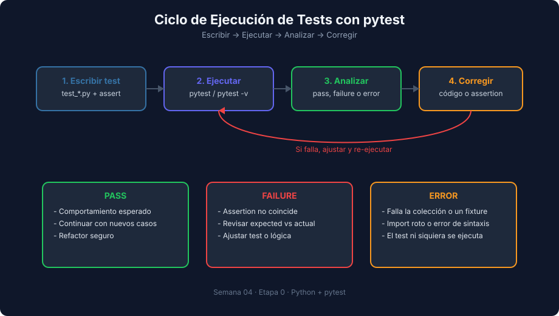

# Setup de Entorno Python + pytest

> **Semana 04 — Teoría 01** | Lenguaje: Python

---

## Objetivo

Configurar un entorno mínimo para ejecutar tests unitarios con `pytest` 9 en Python 3.14.



---

## Requisitos

- [`uv`](https://docs.astral.sh/uv/) instalado (gestiona Python, el entorno virtual y las dependencias)
- Python 3.14 (si no lo tienes, `uv` lo descarga automáticamente)

Comprobación rápida:

```bash
uv --version
uv run python --version   # en Linux/macOS también sirve: python3 --version
```

---

## Estructura recomendada

```text
mi-proyecto-python/
├── src/
│   └── calculator.py
├── tests/
│   └── test_calculator.py
├── pyproject.toml
└── README.md
```

---

## Configuración inicial con `uv`

```bash
mkdir mi-proyecto-python && cd mi-proyecto-python
uv init --bare                  # crea solo pyproject.toml
uv add --dev pytest==9.1.1      # añade pytest al grupo de desarrollo y crea .venv
uv run pytest                   # ejecuta pytest dentro del entorno del proyecto
```

`uv run` usa siempre el entorno virtual del proyecto: no hace falta activarlo a mano. Si clonas un proyecto que ya tiene `pyproject.toml`, basta con `uv sync` para instalar sus dependencias.

Después añade la configuración de pytest al final de `pyproject.toml`. El archivo completo queda así:

```toml
[project]
name = "mi-proyecto-python"
version = "0.1.0"
requires-python = ">=3.14"
dependencies = []

[dependency-groups]
dev = [
    "pytest==9.1.1",
]

[tool.pytest]
pythonpath = ["."]
testpaths = ["tests"]
```

- `pythonpath = ["."]`: añade la raíz del proyecto al `sys.path`, para que `from src.calculator import add` funcione desde `tests/`. Sin esta línea obtendrás `ModuleNotFoundError: No module named 'src'`.
- `testpaths = ["tests"]`: indica a pytest dónde buscar tests.

> **Formas antiguas o alternativas**: antes de pytest 9 la configuración iba en `[tool.pytest.ini_options]` (todavía funciona) o en un archivo `pytest.ini`. Elige **una sola** fuente de configuración: si existe `pytest.ini`, pytest lo usa e ignora lo que pongas en `pyproject.toml` (lo avisa con `WARNING: ignoring pytest config in pyproject.toml!`), y si pones `[tool.pytest]` y `[tool.pytest.ini_options]` a la vez, pytest 9 se detiene con un error. En este bootcamp usamos siempre `[tool.pytest]`.

**Alternativa sin `uv` (`venv` + `pip`)**:

```bash
python3 -m venv .venv
source .venv/bin/activate        # en Windows: .venv\Scripts\activate
python -m pip install pytest==9.1.1
pytest
```

---

## Primer módulo de ejemplo

`src/calculator.py`

```python
def add(a: int, b: int) -> int:
    return a + b


def divide(a: float, b: float) -> float:
    if b == 0:
        raise ValueError("Division by zero")
    return a / b
```

---

## Primer test en pytest

`tests/test_calculator.py`

```python
import pytest

from src.calculator import add, divide


def test_add_returns_five_when_inputs_are_two_and_three() -> None:
    # Arrange
    a = 2
    b = 3

    # Act
    result = add(a, b)

    # Assert
    assert result == 5


def test_divide_raises_value_error_when_divisor_is_zero() -> None:
    # Arrange
    dividend = 10
    divisor = 0

    # Act + Assert
    with pytest.raises(ValueError, match="Division by zero"):
        divide(dividend, divisor)
```

---

## Ejecutar tests

```bash
uv run pytest
uv run pytest -v
uv run pytest -k divide
```

- `uv run pytest`: ejecución estándar
- `uv run pytest -v`: muestra el nombre completo de cada test
- `uv run pytest -k divide`: filtra por nombre de test

Salida real de `uv run pytest -v` con el ejemplo anterior (la ruta se ha acortado):

```text
============================= test session starts ==============================
platform linux -- Python 3.14.7, pytest-9.1.1, pluggy-1.6.0 -- /ruta/mi-proyecto-python/.venv/bin/python
rootdir: /ruta/mi-proyecto-python
configfile: pyproject.toml
testpaths: tests
collecting ... collected 2 items

tests/test_calculator.py::test_add_returns_five_when_inputs_are_two_and_three PASSED [ 50%]
tests/test_calculator.py::test_divide_raises_value_error_when_divisor_is_zero PASSED [100%]

============================== 2 passed in 0.00s ===============================
```

Fíjate en `configfile: pyproject.toml`: confirma que pytest está leyendo tu configuración.

---

## Errores comunes de setup

| Error | Causa probable | Solución |
|---|---|---|
| `ModuleNotFoundError: No module named 'src'` | Falta `pythonpath = ["."]` en `[tool.pytest]` | Añadirlo en `pyproject.toml` |
| `pytest: command not found` | Se ejecuta `pytest` fuera del entorno | Usar `uv run pytest` |
| Se ignora la config de `pyproject.toml` | Hay un `pytest.ini` en la carpeta | Dejar una sola fuente de configuración |
| No se detectan tests | Nombre de archivo/función no cumple convención | Usar `test_*.py` y `def test_*` |

---

## Buenas prácticas base

- Aislar entorno virtual por proyecto (`uv` lo hace por ti)
- Mantener tests en carpeta `tests/`
- Empezar con funciones puras
- Nombrar tests con intención de negocio

---

## Próximo tema

→ [Estructura de un test en pytest y patrón AAA](./02-estructura-test-pytest.md)
