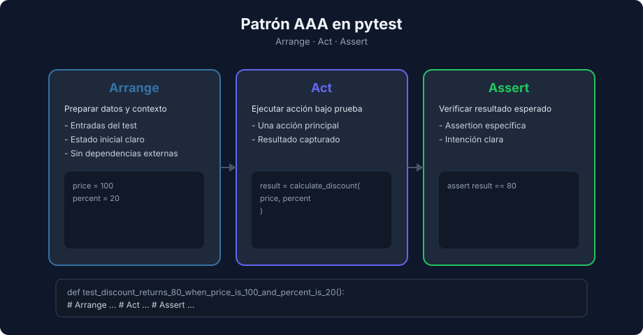

# Estructura de un Test en pytest y Patrón AAA

> **Semana 04 — Teoría 02** | Lenguaje: Python

---

## Anatomía básica en pytest

En pytest, cada test es una función independiente con prefijo `test_`.

```python
def test_add_returns_five_when_inputs_are_two_and_three() -> None:
    assert 2 + 3 == 5
```

No requiere clases ni herencia: basta una función y un `assert`.

---

## pytest frente a `unittest`

Python trae de serie el módulo [`unittest`](https://docs.python.org/3/library/unittest.html) (estilo xUnit, como JUnit). El mismo test en ambos estilos:

```python
# unittest: clase que hereda de TestCase y métodos assert*
import unittest

from src.calculator import add, divide


class TestCalculator(unittest.TestCase):
    def test_add_returns_five_when_inputs_are_two_and_three(self) -> None:
        self.assertEqual(add(2, 3), 5)

    def test_divide_raises_value_error_when_divisor_is_zero(self) -> None:
        with self.assertRaises(ValueError):
            divide(10, 0)
```

```python
# pytest: funciones sueltas y assert nativo
import pytest

from src.calculator import add, divide


def test_add_returns_five_when_inputs_are_two_and_three() -> None:
    assert add(2, 3) == 5


def test_divide_raises_value_error_when_divisor_is_zero() -> None:
    with pytest.raises(ValueError):
        divide(10, 0)
```

| Aspecto | `unittest` | pytest |
|---|---|---|
| Instalación | Incluido en Python | Dependencia externa (`uv add --dev pytest`) |
| Estructura | Clase que hereda de `unittest.TestCase` | Funciones `test_*` (clases opcionales) |
| Verificación | Métodos `self.assertEqual`, `self.assertTrue`, `self.assertIn`… | `assert` nativo con mensajes detallados |
| Excepciones | `self.assertRaises` | `pytest.raises` |
| Ejecución | `python -m unittest` | `pytest` (también ejecuta tests escritos con `unittest`) |

En el bootcamp usamos pytest: menos código repetido y mejores mensajes de fallo. Aun así conviene reconocer `unittest`, porque aparece en muchos proyectos existentes y pytest puede ejecutarlo sin cambios.

---

## Patrón AAA



AAA mantiene legibilidad y claridad:

1. **Arrange**: preparar datos
2. **Act**: ejecutar acción
3. **Assert**: verificar resultado

Ejemplo:

```python
from src.price import calculate_discount


def test_calculate_discount_returns_80_when_price_is_100_and_percent_is_20() -> None:
    # Arrange
    price = 100
    percent = 20

    # Act
    result = calculate_discount(price, percent)

    # Assert
    assert result == 80
```

---

## Nombres descriptivos en pytest

Patrón recomendado:

```text
test_[contexto]_[resultado]_when_[condicion]
```

Ejemplos:

- `test_user_is_adult_returns_true_when_age_is_18`
- `test_discount_raises_error_when_percent_is_greater_than_100`

Nombres a evitar:

- `test1`
- `test_ok`
- `test_funcion`

---

## Tests de excepción

Para validar errores esperados, usa `pytest.raises`.

```python
import pytest
from src.price import calculate_discount


def test_discount_raises_error_when_percent_is_negative() -> None:
    with pytest.raises(ValueError, match="Invalid percent"):
        calculate_discount(100, -1)
```

---

## Setup compartido con funciones helper

Antes de entrar a fixtures avanzadas, puedes centralizar setup con helpers simples.

```python
def build_user() -> dict:
    return {"name": "Ana", "age": 20}


def test_user_has_name_field() -> None:
    user = build_user()
    assert user["name"] == "Ana"
```

En semanas siguientes se profundiza con fixtures en `conftest.py`.

---

## Señales de mal diseño en un test

- Mezcla múltiples comportamientos no relacionados
- No es claro qué está validando
- No distingue Arrange/Act/Assert
- Usa datos ambiguos sin contexto
- Depende de estado externo

---

## Resumen

```text
def test_...():
    # Arrange
    # Act
    # Assert
```

Esa simplicidad permite escalar la suite sin perder mantenibilidad.

---

## Próximo tema

→ [Assertions, ejecución y lectura de reportes](./03-assertions-y-ejecucion.md)
