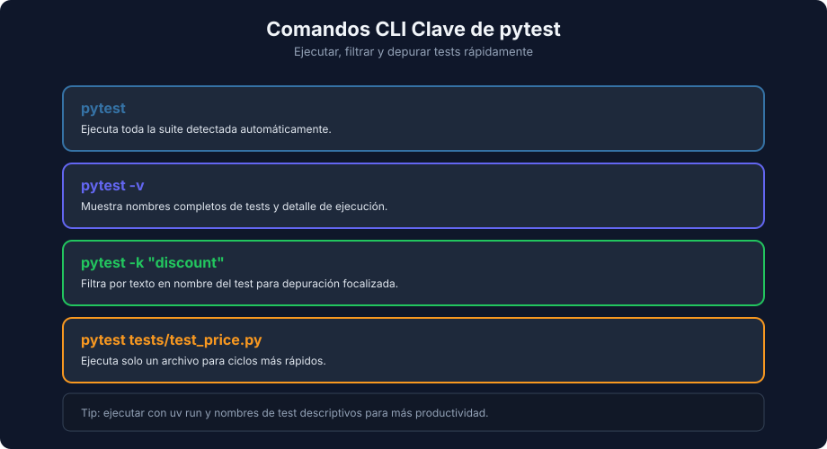

# Assertions, Ejecución y Lectura de Reportes en pytest

> **Semana 04 — Teoría 03** | Lenguaje: Python

---

## Assertion nativo en Python

En pytest, la verificación principal es `assert`.

```python
assert result == expected
```

Ventaja: sintaxis simple y mensajes de error enriquecidos automáticamente por pytest.

---

## Assertions más comunes

```python
assert total == 10               # igualdad
assert total != 0                # desigualdad
assert "error" in message        # pertenencia (texto, lista, dict…)
assert "debug" not in message    # no pertenencia
assert result is None            # ausencia de valor
assert user is not None          # presencia de valor
assert len(items) == 3           # tamaño
assert is_valid is True          # booleano exacto
assert is_valid is False
```

Usa `is` / `is not` solo con `None`, `True` y `False`; para comparar valores usa siempre `==` / `!=`.

Evita asserts ambiguos como:

```python
assert value
```

si puedes expresar mejor la intención con comparación explícita.

---

## Ejecutar y filtrar tests



```bash
uv run pytest
uv run pytest -v
uv run pytest -k "discount"
uv run pytest tests/test_price.py
```

- `-v` ayuda a leer nombres completos
- `-k` permite foco en un subconjunto
- Ejecutar un archivo puntual acelera la depuración

---

## FAILED vs ERROR

pytest distingue dos estados de fallo en el resumen final:

| Estado | Cuándo ocurre | Qué revisar |
|---|---|---|
| `FAILED` | Cualquier excepción **dentro del cuerpo del test**: un `assert` que no se cumple (`AssertionError`) o una excepción inesperada (`TypeError`, `KeyError`…) | La lógica del código o la expectativa del test |
| `ERROR` | Una excepción **fuera del cuerpo del test**: al recolectar el archivo (import roto, error de sintaxis) o en el setup/teardown de un fixture | Imports, estructura del proyecto, fixtures |

### FAILED: assertion no cumplida o excepción inesperada

Con un `calculate_discount` que tiene un bug (resta 1 de más), estos dos tests terminan en `FAILED`. Extracto de la salida real de `uv run pytest tests/test_price.py`:

```text
tests/test_price.py FF                                                   [100%]

=================================== FAILURES ===================================
____________ test_calculate_discount_returns_80_when_percent_is_20 _____________
...
>       assert result == 80
E       assert 79.0 == 80

tests/test_price.py:13: AssertionError
____________ test_calculate_discount_returns_90_when_price_is_text _____________
...
>       return price - (price * percent) / 100 - 1
                       ^^^^^^^^^^^^^^^^^^^^^^^
E       TypeError: unsupported operand type(s) for /: 'str' and 'int'

src/price.py:2: TypeError
=========================== short test summary info ============================
FAILED tests/test_price.py::test_calculate_discount_returns_80_when_percent_is_20 - assert 79.0 == 80
FAILED tests/test_price.py::test_calculate_discount_returns_90_when_price_is_text - TypeError: unsupported operand type(s) for /: 'str' and 'int'
============================== 2 failed in 0.02s ===============================
```

El `TypeError` no llega a la assertion, pero sigue siendo `FAILED`: ocurrió dentro del test.

### ERROR: el test ni siquiera se ejecuta

Si un archivo de test importa una función que no existe, pytest no puede recolectarlo. Extracto de la salida real:

```text
collected 2 items / 1 error

==================================== ERRORS ====================================
____________________ ERROR collecting tests/test_import.py _____________________
ImportError while importing test module '/ruta/proyecto/tests/test_import.py'.
...
E   ImportError: cannot import name 'apply_tax' from 'src.price' (/ruta/proyecto/src/price.py)
=========================== short test summary info ============================
ERROR tests/test_import.py
!!!!!!!!!!!!!!!!!!!! Interrupted: 1 error during collection !!!!!!!!!!!!!!!!!!!!
=============================== 1 error in 0.09s ===============================
```

Un error de colección interrumpe toda la ejecución: ningún test corre hasta que lo arregles. El otro origen de `ERROR` (fallos en fixtures) lo verás al estudiar fixtures en semanas posteriores.

Diagnóstico rápido:

- `FAILED` con `assert ...` → revisar expectativa o lógica
- `FAILED` con otra excepción → revisar tipos de datos o la implementación
- `ERROR` → revisar imports, nombres de archivo y configuración antes de mirar la lógica

---

## Ciclo mínimo Red-Green-Refactor

1. **Red**: crear test que falla
2. **Green**: implementar lo mínimo para pasar
3. **Refactor**: mejorar diseño sin romper tests

```python
# Red: test espera True para edad 18
# Green:
def is_adult(age: int) -> bool:
    return age >= 18
```

---

## Checklist de calidad mínima

- [ ] Nombre del test comunica intención
- [ ] AAA visible
- [ ] Assertion específica
- [ ] Sin dependencias externas
- [ ] Resultado reproducible

---

## Cierre

Con esta base ya puedes traducir la disciplina de testing de JavaScript a Python, manteniendo la misma calidad de diseño y lectura.

← [Estructura de test en pytest](./02-estructura-test-pytest.md) | [Volver al README](../README.md)
