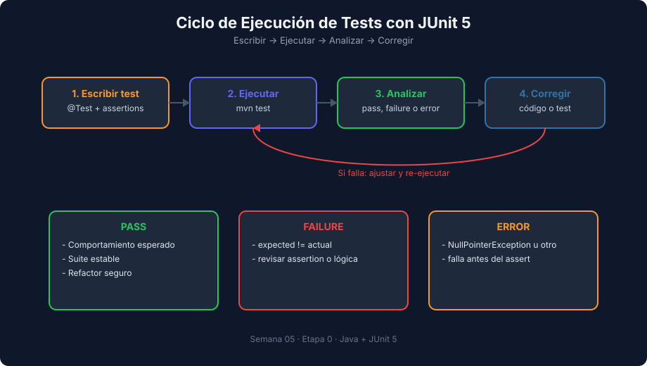

# Setup de Entorno Java + Maven + JUnit 6

> **Semana 05 — Teoría 01** | Lenguaje: Java

---

## Objetivo

Configurar un proyecto mínimo de tests unitarios con JDK 21, Maven y JUnit 6.



---

## Requisitos

- JDK 21 instalado
- Maven 3.9+
- VS Code o IDE Java

Comprobación:

```bash
java -version
mvn -version
```

---

## Estructura estándar Maven

```text
mi-proyecto-java/
├── pom.xml
├── src/
│   ├── main/java/com/bootcamp/Calculator.java
│   └── test/java/com/bootcamp/CalculatorTest.java
```

---

## `pom.xml` mínimo para JUnit 6

```xml
<project xmlns="http://maven.apache.org/POM/4.0.0"
         xmlns:xsi="http://www.w3.org/2001/XMLSchema-instance"
         xsi:schemaLocation="http://maven.apache.org/POM/4.0.0 http://maven.apache.org/xsd/maven-4.0.0.xsd">
  <modelVersion>4.0.0</modelVersion>
  <groupId>com.bootcamp</groupId>
  <artifactId>week05-junit</artifactId>
  <version>1.0.0</version>

  <properties>
    <maven.compiler.release>21</maven.compiler.release>
    <project.build.sourceEncoding>UTF-8</project.build.sourceEncoding>
    <junit.jupiter.version>6.0.3</junit.jupiter.version>
  </properties>

  <dependencies>
    <dependency>
      <groupId>org.junit.jupiter</groupId>
      <artifactId>junit-jupiter</artifactId>
      <version>${junit.jupiter.version}</version>
      <scope>test</scope>
    </dependency>
  </dependencies>

  <build>
    <plugins>
      <plugin>
        <groupId>org.apache.maven.plugins</groupId>
        <artifactId>maven-surefire-plugin</artifactId>
        <version>3.5.6</version>
      </plugin>
    </plugins>
  </build>
</project>
```

Puntos clave:

- `maven.compiler.release` compila para Java 21 y valida que solo uses APIs de esa versión.
- `junit-jupiter` agrupa la API para escribir tests y el motor que los ejecuta.
- `<scope>test</scope>`: la dependencia solo existe para `src/test`, no se empaqueta con tu aplicación.
- Versiones exactas (`6.0.3`, `3.5.6`): el build da el mismo resultado hoy y dentro de seis meses.

---

## Primera clase de ejemplo

`Calculator.java`

```java
package com.bootcamp;

public class Calculator {
    public static int add(int a, int b) {
        return a + b;
    }

    public static double divide(double a, double b) {
        if (b == 0) {
            throw new IllegalArgumentException("Division by zero");
        }
        return a / b;
    }
}
```

---

## Primer test

`CalculatorTest.java`

```java
package com.bootcamp;

import org.junit.jupiter.api.DisplayName;
import org.junit.jupiter.api.Test;

import static org.junit.jupiter.api.Assertions.*;

class CalculatorTest {

    @Test
    @DisplayName("should return 5 when adding 2 and 3")
    void shouldReturnFiveWhenAddingTwoAndThree() {
        int result = Calculator.add(2, 3);
        assertEquals(5, result);
    }

    @Test
    @DisplayName("should throw error when dividing by zero")
    void shouldThrowErrorWhenDividingByZero() {
        IllegalArgumentException ex = assertThrows(
            IllegalArgumentException.class,
            () -> Calculator.divide(10, 0)
        );
        assertEquals("Division by zero", ex.getMessage());
    }
}
```

---

## Ejecutar tests

```bash
mvn test
```

Salida esperada (resumen):

```text
Tests run: 2, Failures: 0, Errors: 0, Skipped: 0
BUILD SUCCESS
```

---

## Errores comunes

| Error | Causa | Solución |
|---|---|---|
| No encuentra `@Test` | Dependencia JUnit faltante | Revisar `pom.xml` |
| Tests no corren | Archivo fuera de `src/test/java` | Ajustar estructura Maven |
| `release version 21 not supported` | Maven usa un JDK anterior a 21 | Revisar `mvn -version` y `JAVA_HOME` |
| `Tests run: 0` | Clase o método sin `@Test`, o clase que no termina en `Test` | Revisar anotaciones y nombre de la clase |
| `Using platform encoding ... build is platform dependent` | Falta `project.build.sourceEncoding` | Añadir `UTF-8` en `<properties>` |

---

## Próximo tema

→ [Estructura de un test en JUnit 6](./02-estructura-test-junit.md)
