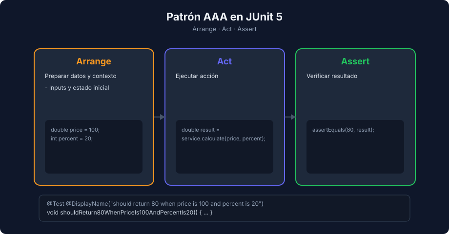

# Estructura de un Test en JUnit 6

> **Semana 05 — Teoría 02** | Lenguaje: Java

---

## Anatomía base

Un test en JUnit 6 se apoya en:

- `@Test` para marcar un método de prueba (sin `public`: basta con visibilidad de paquete)
- `@DisplayName` para darle un nombre legible
- Assertions estáticas de `org.junit.jupiter.api.Assertions`



---

## Patrón AAA en Java

```java
@Test
@DisplayName("should return 80 when price is 100 and discount is 20")
void shouldReturn80WhenPriceIs100AndDiscountIs20() {
    // Arrange
    double price = 100;
    int percent = 20;

    // Act
    double result = UserUtils.calculateDiscount(price, percent);

    // Assert
    assertEquals(80, result);
}
```

---

## Nombres de métodos y `@DisplayName`

Patrón del bootcamp: `should[ExpectedResult]When[Condition]`, por ejemplo `shouldReturnFalseWhenEmailIsInvalid`.

`@DisplayName` se muestra en el panel de tests del IDE (VS Code, IntelliJ). **El resumen de Maven Surefire usa el nombre del método**, no el `@DisplayName`:

```text
[ERROR]   UserUtilsTest.shouldReturnFalseWhenEmailIsNull:137 » NullPointer ...
```

Por eso ambos deben ser descriptivos: un método llamado `test1` deja un reporte de Maven ilegible aunque tenga un buen `@DisplayName`.

---

## Ciclo de vida: `@BeforeEach`, `@AfterEach`, `@BeforeAll`, `@AfterAll`

```java
class LifecycleTest {

    @BeforeAll
    static void beforeAll() { System.out.println("@BeforeAll"); }

    @BeforeEach
    void beforeEach() { System.out.println("  @BeforeEach"); }

    @AfterEach
    void afterEach() { System.out.println("  @AfterEach"); }

    @AfterAll
    static void afterAll() { System.out.println("@AfterAll"); }

    @Test
    void first() { System.out.println("    test 1"); }

    @Test
    void second() { System.out.println("    test 2"); }
}
```

Salida real con `mvn test`:

```text
@BeforeAll
  @BeforeEach
    test 2
  @AfterEach
  @BeforeEach
    test 1
  @AfterEach
@AfterAll
```

Tres lecciones:

1. `@BeforeEach`/`@AfterEach` rodean **cada** test; `@BeforeAll`/`@AfterAll` se ejecutan una sola vez y deben ser `static`.
2. JUnit crea **una instancia nueva de la clase por cada test**: los campos no se comparten entre tests, y eso los aísla.
3. El orden de los métodos es determinista pero no es el orden del archivo (`test 2` corrió primero). Un test nunca debe depender de otro.

Uso típico de `@BeforeEach`: crear el objeto bajo prueba sin duplicar código.

```java
private UserService service;

@BeforeEach
void setUp() {
    service = new UserService();
}
```

---

## JUnit 4 vs JUnit Jupiter (JUnit 5 y 6)

| Concepto | JUnit 4 | JUnit Jupiter (JUnit 5 y 6) |
|---|---|---|
| Paquete | `org.junit` | `org.junit.jupiter.api` |
| Antes/después de cada test | `@Before` / `@After` | `@BeforeEach` / `@AfterEach` |
| Antes/después de la clase | `@BeforeClass` / `@AfterClass` | `@BeforeAll` / `@AfterAll` |
| Desactivar un test | `@Ignore` | `@Disabled` |
| Excepciones | `@Test(expected = X.class)` | `assertThrows(X.class, () -> ...)` |
| Visibilidad | clase y métodos `public` | visibilidad de paquete suficiente |

`assertThrows` es más preciso que `expected`: verifica que la excepción la lance **esa línea** y devuelve la excepción para revisar su mensaje. Si ves `import org.junit.Test;` en un tutorial, es JUnit 4.

JUnit 6 (la versión del bootcamp, 6.0.3) mantiene la misma API Jupiter que JUnit 5: mismas anotaciones, mismo paquete `org.junit.jupiter.api` y mismas assertions. Cambia la base (requiere Java 17 o superior) y la numeración del proyecto. Por eso un tutorial titulado "JUnit 5" sigue siendo válido para escribir tests en JUnit 6.

---

## Señales de mala calidad en tests

- Verifican varias cosas no relacionadas
- El nombre del método no comunica intención
- No siguen AAA
- Dependen de estado externo o del orden de ejecución
- Fallan de forma intermitente

---

## Próximo tema

→ [Assertions y ejecución con Maven](./03-assertions-y-ejecucion.md)
