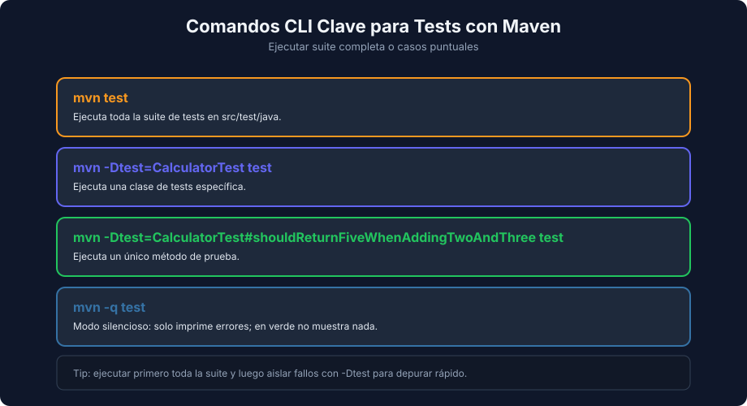

# Assertions y Ejecución con Maven

> **Semana 05 — Teoría 03** | Lenguaje: Java

---

## Assertions más usadas en JUnit 6

```java
assertEquals(10, total);
assertTrue(isValid);
assertFalse(isExpired);
assertNotNull(user);
```

Para excepciones, `assertThrows` devuelve la excepción y permite verificar su mensaje:

```java
IllegalArgumentException ex = assertThrows(
    IllegalArgumentException.class,
    () -> UserUtils.calculateDiscount(100, 120)
);
assertEquals("Invalid percent", ex.getMessage());
```

### Decimales: `assertEquals` con delta

```java
double result = UserUtils.calculateDiscount(19.99, 20);
assertEquals(15.992, result);          // falla
assertEquals(15.992, result, 0.0001);  // pasa
```

```text
expected: <15.992> but was: <15.991999999999999>
```

Los `double` son aproximaciones binarias. Con decimales, compara siempre con un delta (tolerancia).

---

## Ejecutar tests



```bash
mvn test
mvn -Dtest=CalculatorTest test
mvn -Dtest=CalculatorTest#shouldReturnFiveWhenAddingTwoAndThree test
```

---

## Failure vs Error en JUnit

Surefire cuenta por separado dos formas de fallar. Con esta clase (el `isValidEmail` original no controla `null`):

```java
class FailureVsErrorTest {

    @Test
    void shouldReturnTrueWhenAgeIs17() {
        assertTrue(UserUtils.isAdult(17));
    }

    @Test
    void shouldReturnFalseWhenEmailIsNull() {
        assertFalse(UserUtils.isValidEmail(null));
    }
}
```

Salida real de `mvn test`:

```text
[ERROR] Failures:
[ERROR]   FailureVsErrorTest.shouldReturnTrueWhenAgeIs17:11 expected: <true> but was: <false>
[ERROR] Errors:
[ERROR]   FailureVsErrorTest.shouldReturnFalseWhenEmailIsNull:16 » NullPointer Cannot invoke "String.contains(java.lang.CharSequence)" because "email" is null
[ERROR] Tests run: 2, Failures: 1, Errors: 1, Skipped: 0
```

| Resultado | Qué pasó | Qué revisar |
|---|---|---|
| **Failure** | Una assertion no se cumplió (`AssertionFailedError`) | El valor esperado o la lógica bajo prueba |
| **Error** | Una excepción inesperada interrumpió el test antes o durante el Act | El código de producción o el Arrange del test |

> Ojo: pytest (semana 04) reporta ambos casos como `FAILED`; JUnit y Surefire sí los distinguen.

---

## Reportes de Surefire

Además de la consola, cada `mvn test` deja reportes en `target/surefire-reports/`:

```text
target/surefire-reports/
├── com.bootcamp.UserUtilsTest.txt        # resumen y stack traces completos
└── TEST-com.bootcamp.UserUtilsTest.xml   # formato JUnit XML
```

El `.txt` sirve para leer el stack trace completo. El `.xml` es el formato que leen los servidores de CI y los IDE para mostrar resultados.

---

## AssertJ: assertions fluentes

AssertJ es una librería de assertions que se añade como dependencia de test (`org.assertj:assertj-core`). Se lee como una frase:

```java
import static org.assertj.core.api.Assertions.assertThat;
import static org.assertj.core.api.Assertions.assertThatThrownBy;

assertThat(result).isEqualTo(80.0);

assertThatThrownBy(() -> UserUtils.calculateDiscount(100, -5))
    .isInstanceOf(IllegalArgumentException.class)
    .hasMessage("Invalid percent");

assertThat(UserUtils.isAdult(17)).as("age 17 is adult").isTrue();
```

Con `as(...)` el mensaje de fallo explica la intención:

```text
[age 17 is adult]
Expecting value to be true but was false
```

En esta semana basta con conocer `assertThat` y `assertThatThrownBy`; la semana 25 profundiza en AssertJ.

---

## Checklist de calidad mínima

- [ ] Nombre del método y `@DisplayName` descriptivos
- [ ] AAA visible
- [ ] Assertions específicas (delta con `double`)
- [ ] Sin dependencias externas reales
- [ ] `mvn test` con el número de tests esperado, 0 failures y 0 errors

---

## Cierre

Con esta base ya puedes expresar en Java la misma intención de pruebas que viste en JavaScript y Python.

← [Estructura en JUnit 6](./02-estructura-test-junit.md) | [Volver al README](../README.md)
