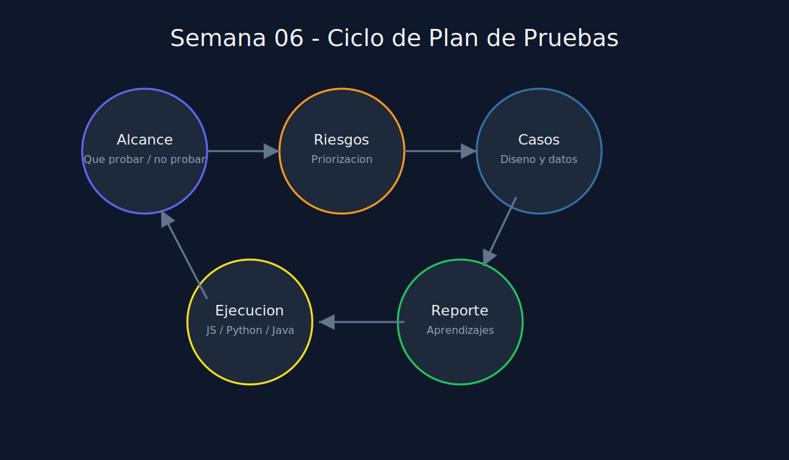

# 01 - Plan de Pruebas y Trazabilidad

**Tipo**: Transversal (JS / Python / Java)

## Que es un plan de pruebas

Un plan de pruebas es un documento operativo que responde:

- Que se va a probar.
- Que no se va a probar.
- Como se ejecutara.
- Quien participa.
- Cuando se considera completado.

## Estructura minima recomendada

1. Alcance del modulo.
2. Supuestos y restricciones.
3. Riesgos funcionales y tecnicos.
4. Estrategia de pruebas (manual/automatizada).
5. Criterios de entrada y salida.
6. Matriz de trazabilidad.

## Ejemplo de matriz de trazabilidad

| Requirement ID | Caso de prueba | Tipo | Prioridad | Estado |
|---|---|---|---|---|
| REQ-001 | TC-001 crear item valido | Unit | Alta | Pendiente |
| REQ-002 | TC-002 rechaza nombre vacio | Unit | Alta | Pendiente |
| REQ-003 | TC-003 rechaza cantidad negativa | Unit | Alta | Pendiente |

## Criterios de entrada y salida

### Entrada

- Reglas de negocio acordadas.
- Ambiente local de pruebas disponible.
- Datos de prueba ficticios preparados.

### Salida

- 100% de casos criticos ejecutados.
- Sin bloqueantes abiertos.
- Evidencia de resultados consolidada.

## Error comun

Confundir "ejecutar tests" con "tener estrategia de calidad". Una suite sin trazabilidad puede pasar en verde y aun asi dejar riesgos sin cubrir.
