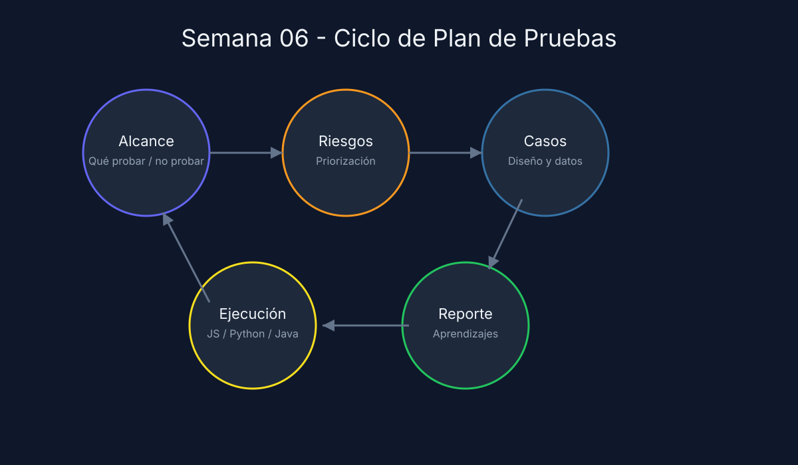

# 01 - Plan de Pruebas y Trazabilidad

**Tipo**: Transversal (JS / Python / Java)

## Qué es un plan de pruebas

Un plan de pruebas es un documento operativo que responde:

- Qué se va a probar.
- Qué no se va a probar.
- Cómo se ejecutará.
- Quién participa.
- Cuándo se considera completado.

Sin este documento, el equipo prueba lo que recuerda o lo que le parece importante ese día. Con él, la cobertura es una decisión explícita, no un accidente.

## Estructura mínima recomendada

1. **Alcance del módulo** — que funcionalidad entra y cuál queda fuera de esta ronda.
2. **Supuestos y restricciones** — que se asume verdadero (ej. base de datos ya migrada) y que limita el trabajo (ej. sin acceso a ambiente de staging).
3. **Riesgos funcionales y técnicos** — que puede fallar y que tan grave sería.
4. **Estrategia de pruebas** — mezcla de manual/automatizada y en que capa (unit, integración, end-to-end).
5. **Criterios de entrada y salida** — cuando se puede empezar a ejecutar y cuando se declara terminado.
6. **Matriz de trazabilidad** — el mapa que conecta cada requerimiento con su evidencia de prueba.

## Alcance: que entra y que no

El alcance mal definido es la causa más común de un plan inútil. No basta con decir "se prueba el módulo de reservas"; hay que declarar límites.

Ejemplo para un sistema de reservas de turnos en un planetario:

**Dentro de alcance**:

- Creación de una reserva con datos válidos.
- Rechazo de reservas con cupo agotado.
- Cálculo de disponibilidad por franja horaria.

**Fuera de alcance**:

- Integración con pasarela de pago (se prueba en otra suite).
- Notificaciones por correo (módulo separado, semana futura).
- Carga masiva de eventos administrativos.

Declarar el "fuera de alcance" evita que el equipo asuma cobertura donde no la hay.

## Ejemplo de matriz de trazabilidad

| Requirement ID | Caso de prueba | Tipo | Prioridad | Estado |
|---|---|---|---|---|
| REQ-001 | TC-001 crear reserva válida | Unit | Alta | Pendiente |
| REQ-002 | TC-002 rechaza reserva sin cupo | Unit | Alta | Pendiente |
| REQ-003 | TC-003 rechaza franja horaria inválida | Unit | Alta | Pendiente |
| REQ-004 | TC-004 calcula disponibilidad restante | Integration | Media | Pendiente |

Cada fila es una promesa: "este requerimiento tiene evidencia de que fue probado". Una fila sin caso de prueba es un requerimiento sin garantía.

## Cómo enlazar un caso de prueba a un requerimiento

La trazabilidad no es un ID puesto porque sí. Sigue una convención simple:

1. Cada requerimiento tiene un identificador único (`REQ-XXX`).
2. Cada caso de prueba referencia el requerimiento que valida (`TC-XXX` -> `REQ-XXX`).
3. Un requerimiento puede tener varios casos de prueba (positivo, negativo, borde).
4. Un caso de prueba debería validar un solo requerimiento — si valida dos, es candidato a dividirse.

El nombre del test también es trazabilidad. Sin importar el lenguaje, el nombre debe reflejar el `REQ` que cubre:

| Lenguaje | Convención de nombre | Ejemplo para REQ-002 |
|---|---|---|
| JavaScript (Jest) | `should` + comportamiento esperado | `should reject booking when capacity is full` |
| Python (pytest) | `test_` + snake_case descriptivo | `test_rejects_booking_when_capacity_is_full` |
| Java (JUnit 5) | `@DisplayName` + método camelCase | `rejectsBookingWhenCapacityIsFull` |

El lenguaje cambia, la trazabilidad hacia `REQ-002` no.

## Criterios de entrada y salida

### Entrada

- Reglas de negocio acordadas.
- Ambiente local de pruebas disponible.
- Datos de prueba ficticios preparados.

### Salida

- 100% de casos críticos ejecutados.
- Sin bloqueantes abiertos.
- Evidencia de resultados consolidada.

## Errores frecuentes cuando el plan es muy vago

- **Alcance ambiguo**: "probar el módulo completo" sin listar que casos concretos aplica.
- **Sin matriz de trazabilidad**: la suite pasa en verde pero nadie sabe que requerimiento cubre cada test.
- **Criterios de salida subjetivos**: "cuando esté listo" en vez de un número o condición verificable.
- **Riesgos no priorizados**: todos los casos con la misma prioridad "alta" no priorizan nada.
- **Plan que nadie actualiza**: el documento queda desincronizado del código después del primer cambio de requerimiento.

## Error común

Confundir "ejecutar tests" con "tener estrategia de calidad". Una suite sin trazabilidad puede pasar en verde y aun así dejar riesgos sin cubrir.

## Regla práctica

Si no puedes responder "¿qué requerimiento valida este test?" en menos de cinco segundos, la trazabilidad está rota. Arréglala antes de agregar más tests.
