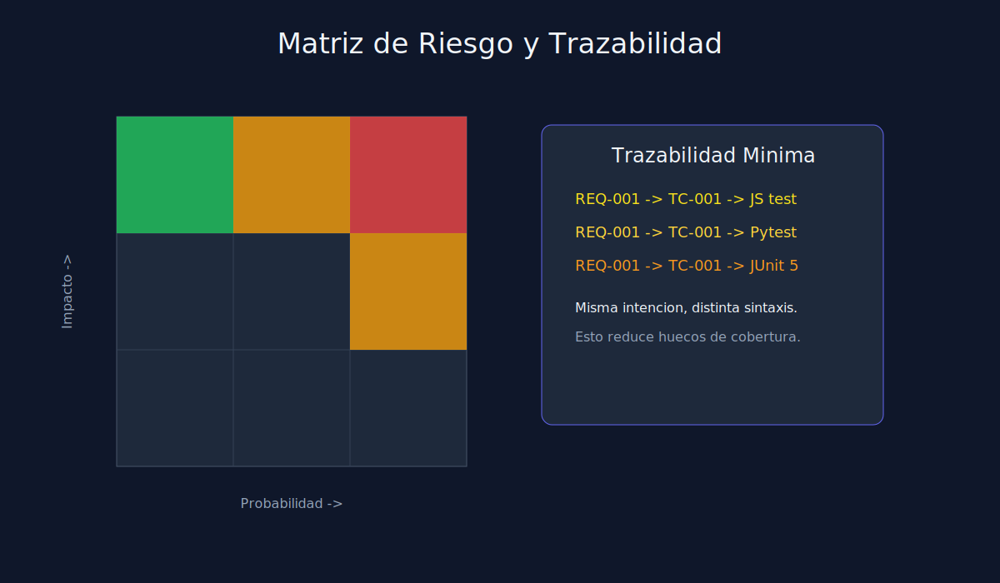

# 02 - Diseno de Casos por Riesgo (Multilenguaje)

**Tipo**: Transversal (JS / Python / Java)



## Modelo simple de priorizacion

Usa una matriz de dos ejes:

- Impacto de fallo (alto, medio, bajo)
- Probabilidad de ocurrencia (alta, media, baja)

Regla de decision:

- Alto impacto + alta probabilidad => prioridad alta.
- Alto impacto + baja probabilidad => prioridad media.
- Bajo impacto + baja probabilidad => prioridad baja.

## Plantilla de caso de prueba

| Campo | Ejemplo |
|---|---|
| Test Case ID | TC-009 |
| Requirement ID | REQ-004 |
| Titulo | should throw ValidationError when price is negative |
| Precondiciones | Servicio inicializado |
| Datos | `{ "price": -10 }` |
| Pasos | invocar `createItem` |
| Resultado esperado | lanza `ValidationError` |
| Prioridad | Alta |

## Equivalencia de intencion entre lenguajes

La regla de negocio es una sola. Solo cambia la sintaxis.

### JavaScript (Jest)

```javascript
test("should throw ValidationError when price is negative", () => {
  expect(() => service.createItem({ price: -10 })).toThrow("ValidationError");
});
```

### Python (pytest)

```python
def test_should_throw_validation_error_when_price_is_negative():
    with pytest.raises(ValueError, match="ValidationError"):
        service.create_item({"price": -10})
```

### Java (JUnit 5)

```java
@Test
@DisplayName("should throw ValidationError when price is negative")
void shouldThrowValidationErrorWhenPriceIsNegative() {
    assertThrows(IllegalArgumentException.class, () -> service.createItem(-10));
}
```

## Buenas practicas

- Un test = una razon principal de fallo.
- Nombre del test como documentacion ejecutable.
- Datos de prueba minimalistas y expresivos.
