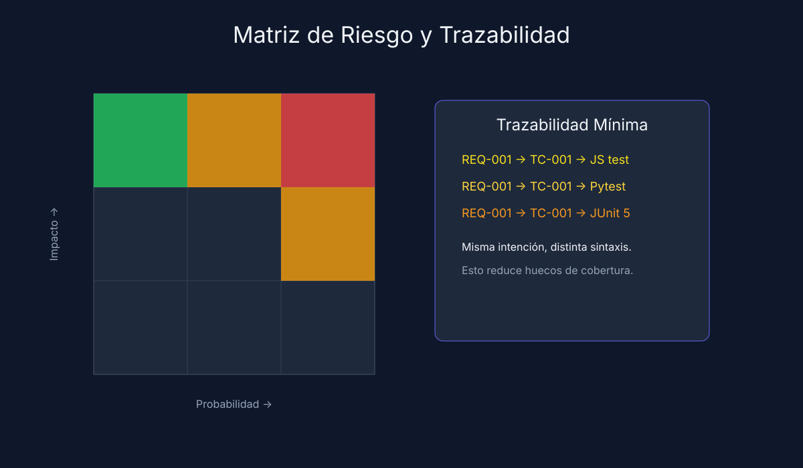

# 02 - Diseño de Casos por Riesgo (Multilenguaje)

**Tipo**: Transversal (JS / Python / Java)



## Modelo simple de priorización

Usa una matriz de dos ejes:

- Impacto de fallo (alto, medio, bajo)
- Probabilidad de ocurrencia (alta, media, baja)

Regla de decisión:

- Alto impacto + alta probabilidad => prioridad alta.
- Alto impacto + baja probabilidad => prioridad media.
- Bajo impacto + baja probabilidad => prioridad baja.

## Plantilla de caso de prueba

| Campo | Ejemplo |
|---|---|
| Test Case ID | TC-009 |
| Requirement ID | REQ-004 |
| Título | should throw a validation error when price is negative |
| Precondiciones | Servicio inicializado |
| Datos | `{ "price": -10 }` |
| Pasos | invocar `createItem` |
| Resultado esperado | error de validación con el mensaje `price must be greater than or equal to 0` |
| Prioridad | Alta |

## Equivalencia de intención entre lenguajes

La regla de negocio es una sola. Solo cambia la sintaxis.

### JavaScript (Jest)

```javascript
test("should throw a validation error when price is negative", () => {
  expect(() => service.createItem({ price: -10 })).toThrow(
    "price must be greater than or equal to 0",
  );
});
```

### Python (pytest)

```python
def test_create_item_raises_value_error_when_price_is_negative() -> None:
    with pytest.raises(ValueError, match="price must be greater than or equal to 0"):
        service.create_item({"price": -10})
```

El tipo de excepción se comprueba con el primer argumento (`ValueError`); `match` es una expresión regular que se busca en el **mensaje** de la excepción (`str(error)`), no en el nombre de la clase. Si el servicio lanza `ValueError("price must be greater than or equal to 0")`, el test pasa; con cualquier otro tipo o mensaje, falla.

### Java (JUnit 5)

```java
@Test
@DisplayName("should throw a validation error when price is negative")
void shouldThrowValidationErrorWhenPriceIsNegative() {
    IllegalArgumentException error = assertThrows(
        IllegalArgumentException.class, () -> service.createItem(-10));
    assertEquals("price must be greater than or equal to 0", error.getMessage());
}
```

## Buenas prácticas

- Un test = una razón principal de fallo.
- Nombre del test como documentación ejecutable.
- Datos de prueba minimalistas y expresivos.
