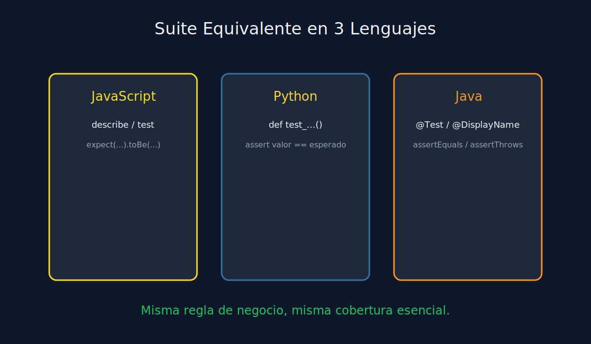

# 03 - Suite Base Equivalente: JS, Python y Java

**Tipo**: Transversal (JS / Python / Java)



## Objetivo

Crear una suite minima equivalente para una regla simple:

> "El servicio acepta montos positivos y rechaza montos negativos."

## Estructura recomendada

1. Test de caso valido (happy path).
2. Test de validacion por dato invalido.
3. Test de valor limite (ejemplo: cero).

## Ejemplo JavaScript (Jest)

```javascript
describe("AmountService", () => {
  test("should return true when amount is positive", () => {
    expect(isValidAmount(20)).toBe(true);
  });

  test("should return false when amount is negative", () => {
    expect(isValidAmount(-1)).toBe(false);
  });
});
```

## Ejemplo Python (pytest)

```python
def test_should_return_true_when_amount_is_positive():
    assert is_valid_amount(20) is True


def test_should_return_false_when_amount_is_negative():
    assert is_valid_amount(-1) is False
```

## Ejemplo Java (JUnit 5)

```java
@Test
@DisplayName("should return true when amount is positive")
void shouldReturnTrueWhenAmountIsPositive() {
    assertTrue(AmountValidator.isValid(20));
}

@Test
@DisplayName("should return false when amount is negative")
void shouldReturnFalseWhenAmountIsNegative() {
    assertFalse(AmountValidator.isValid(-1));
}
```

## Cierre de etapa

Si puedes expresar la misma intencion de test en tres lenguajes, ya tienes base solida para avanzar a las etapas especializadas.
