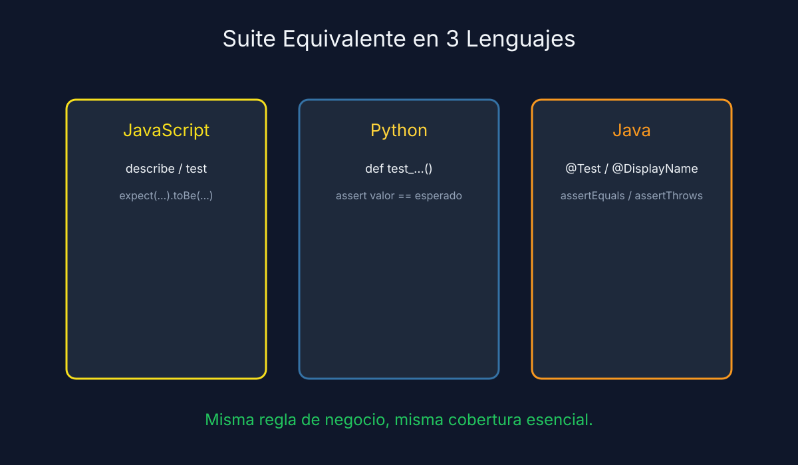

# 03 - Suite Base Equivalente: JS, Python y Java

**Tipo**: Transversal (JS / Python / Java)



## Objetivo

Crear una suite mínima equivalente para una regla simple:

> "El servicio acepta montos positivos y rechaza montos negativos."

## Estructura recomendada

1. Test de caso válido (happy path).
2. Test de validación por dato inválido.
3. Test de valor límite (ejemplo: cero).

## Ejemplo JavaScript (Jest)

```javascript
describe("AmountService", () => {
  test("should return true when amount is positive", () => {
    expect(isValidAmount(20)).toBe(true);
  });

  test("should return false when amount is negative", () => {
    expect(isValidAmount(-1)).toBe(false);
  });
});
```

## Ejemplo Python (pytest)

```python
def test_is_valid_amount_returns_true_when_amount_is_positive() -> None:
    assert is_valid_amount(20) is True


def test_is_valid_amount_returns_false_when_amount_is_negative() -> None:
    assert is_valid_amount(-1) is False
```

## Ejemplo Java (JUnit 6)

```java
private final AmountValidator validator = new AmountValidator();

@Test
@DisplayName("should return true when amount is positive")
void shouldReturnTrueWhenAmountIsPositive() {
    assertTrue(validator.isValid(20));
}

@Test
@DisplayName("should return false when amount is negative")
void shouldReturnFalseWhenAmountIsNegative() {
    assertFalse(validator.isValid(-1));
}
```

## Cierre de etapa

Si puedes expresar la misma intención de test en tres lenguajes, ya tienes base sólida para avanzar a las etapas especializadas.
