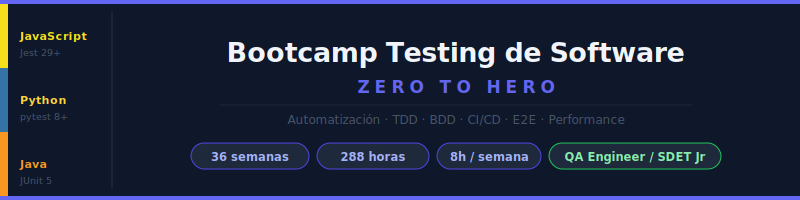

# Semana 06 - Cierre Etapa 0: Plan de Pruebas y Suite Base Multilenguaje

> **Etapa 0 - Fundamentos de Testing** | Semana 6 de 6



---

## Objetivos de la Semana

Al finalizar esta semana seras capaz de:

1. Construir un plan de pruebas basico a partir de requerimientos funcionales.
2. Definir criterios de entrada y salida para ejecucion de tests.
3. Priorizar casos por riesgo y valor de negocio.
4. Escribir una suite base equivalente en JavaScript, Python y Java.
5. Mantener nomenclatura de tests descriptiva en los tres lenguajes.
6. Cerrar la Etapa 0 con una evidencia integradora reutilizable para semanas futuras.

---

## Distribucion del Tiempo (8 horas)

| Actividad | Contenido | Tiempo |
|---|---|---|
| Teoria | Plan de pruebas, trazabilidad y equivalencias multilenguaje | 2.5 h |
| Practicas | Diseno de casos + suite base en JS/Python/Java | 3 h |
| Proyecto | Entregable integrador del dominio asignado | 2 h |
| Recursos y cierre | Revision de checklist y consolidacion | 0.5 h |

---

## Contenido de la Semana

### Teoria

1. [Plan de pruebas y trazabilidad](./1-teoria/01-plan-de-pruebas-y-trazabilidad.md)
2. [Diseno de casos de prueba por riesgo](./1-teoria/02-diseno-de-casos-multilenguaje.md)
3. [Suite base equivalente en JS, Python y Java](./1-teoria/03-suite-base-js-python-java.md)

### Practicas

- [Ejercicio 01 - Plan de pruebas integrador](./2-practicas/ejercicio-01-plan-pruebas-integrador/)
- [Ejercicio 02 - Suite base multilenguaje](./2-practicas/ejercicio-02-suite-base-multilenguaje/)

### Proyecto

- [Proyecto integrador Etapa 0](./3-proyecto/README.md)

### Recursos

- [Ebooks gratuitos](./4-recursos/ebooks-free/README.md)
- [Videografia](./4-recursos/videografia/README.md)
- [Webgrafia](./4-recursos/webgrafia/README.md)

### Glosario

- [Terminos clave de la semana](./5-glosario/README.md)

---

## Estructura de Carpetas

```
week-06/
|-- README.md
|-- rubrica-evaluacion.md
|-- 0-assets/
|   |-- 01-plan-pruebas-ciclo.svg
|   |-- 02-trazabilidad-riesgo.svg
|   `-- 03-suite-equivalente.svg
|-- 1-teoria/
|   |-- 01-plan-de-pruebas-y-trazabilidad.md
|   |-- 02-diseno-de-casos-multilenguaje.md
|   `-- 03-suite-base-js-python-java.md
|-- 2-practicas/
|   |-- ejercicio-01-plan-pruebas-integrador/
|   `-- ejercicio-02-suite-base-multilenguaje/
|-- 3-proyecto/
|   |-- README.md
|   `-- starter/
|-- 4-recursos/
|   |-- ebooks-free/README.md
|   |-- videografia/README.md
|   `-- webgrafia/README.md
`-- 5-glosario/
    `-- README.md
```

---

## Nota Importante

En esta semana se integra todo lo trabajado en fundamentos. El objetivo es asegurar que una misma intencion de calidad pueda expresarse en tres lenguajes sin perder claridad.

---

## Navegacion

| <- Semana anterior | Siguiente semana -> |
|---|---|
| [Semana 05 - Primeros Tests con Java](../week-05/README.md) | [Semana 07 - Testing con JavaScript: base de Jest](../week-07/README.md) |
