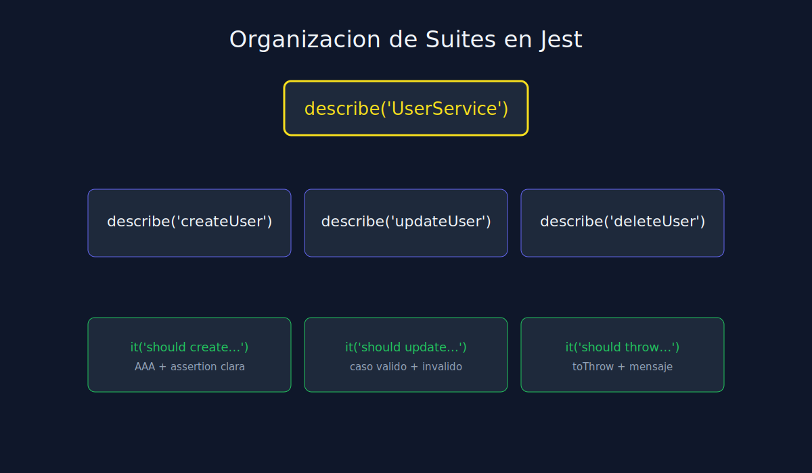

# 01 - Organizacion de Suites y Convenciones de Jest

**Tipo**: JavaScript (Jest)



## Objetivo

Pasar de tests sueltos a una suite estructurada y mantenible.

## Estructura recomendada

```javascript
describe("UserService", () => {
  describe("createUser", () => {
    it("should create user when payload is valid", () => {
      // Arrange
      // Act
      // Assert
    });
  });

  describe("deleteUser", () => {
    it("should throw NotFoundError when user does not exist", () => {
      // Arrange
      // Act
      // Assert
    });
  });
});
```

## Reglas de oro

1. Un `describe` principal por modulo o clase.
2. Un `describe` secundario por metodo o comportamiento.
3. Tests nombrados con formato `should [expected] when [condition]`.
4. Evitar repetir setup en cada test cuando un hook puede simplificar.

## Olores comunes

- Suite plana con 30 tests sin agrupacion.
- Nombres ambiguos como `works` o `test1`.
- Multiples comportamientos mezclados en un solo test.

## Beneficio clave

Una buena estructura reduce friccion en code review y acelera debugging.
