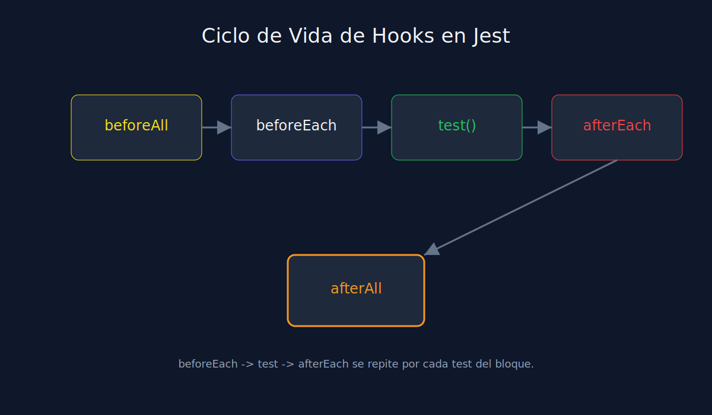

# 02 - Ciclo de Vida con Hooks en Jest

**Tipo**: JavaScript (Jest)



## Hooks disponibles

- `beforeAll`: corre una vez antes del bloque.
- `beforeEach`: corre antes de cada test.
- `afterEach`: limpieza despues de cada test.
- `afterAll`: limpieza final del bloque.

## Ejemplo

```javascript
describe("CartService", () => {
  let cart;

  beforeEach(() => {
    cart = [];
  });

  afterEach(() => {
    jest.clearAllMocks();
  });

  test("should add item when payload is valid", () => {
    cart.push({ sku: "A-1", qty: 1 });
    expect(cart).toHaveLength(1);
  });
});
```

## Criterio practico

- Usa `beforeEach` cuando el estado debe reiniciarse siempre.
- Usa `beforeAll` para setup costoso compartido.
- Mantiene hooks cerca de los tests que los necesitan.

## Error frecuente

Poner toda la inicializacion en un unico `beforeAll` y terminar con tests acoplados por estado residual.
