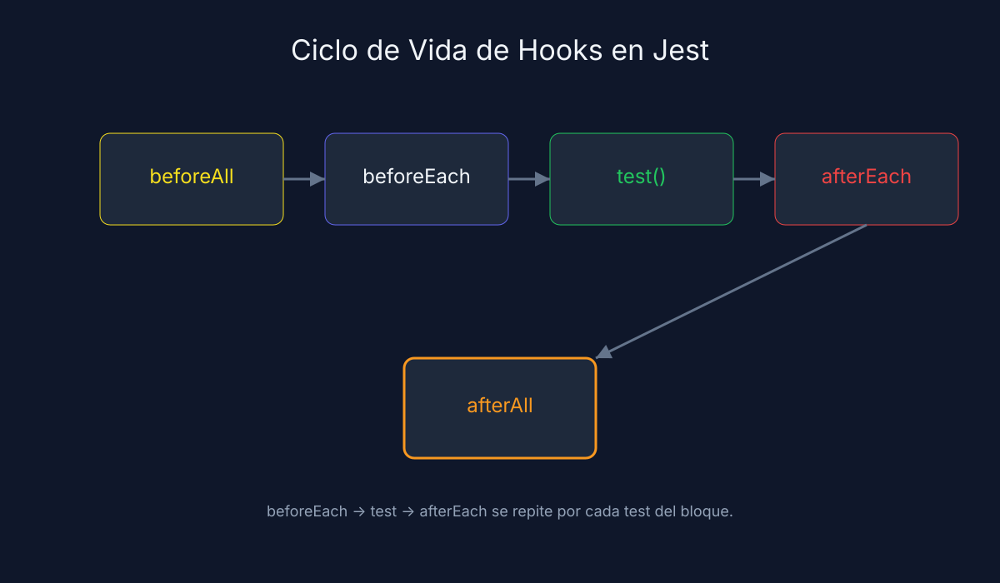

# 02 - Ciclo de Vida con Hooks en Jest

**Tipo**: JavaScript (Jest)



---

## Hooks disponibles

- `beforeAll`: corre una vez antes del bloque.
- `beforeEach`: corre antes de cada test.
- `afterEach`: limpieza después de cada test.
- `afterAll`: limpieza final del bloque.

---

## Orden de ejecución

Para un `describe` con dos tests, Jest ejecuta los hooks en este orden:

```
beforeAll
  beforeEach -> test 1 -> afterEach
  beforeEach -> test 2 -> afterEach
afterAll
```

`beforeAll`/`afterAll` corren una sola vez por bloque; `beforeEach`/`afterEach` corren una vez por test, sin importar cuántos tests haya.

---

## Ejemplo

```javascript
describe("ExhibitCartService", () => {
  let cart;

  beforeEach(() => {
    cart = [];
  });

  afterEach(() => {
    jest.clearAllMocks();
  });

  test("should add item when payload is valid", () => {
    cart.push({ sku: "A-1", qty: 1 });
    expect(cart).toHaveLength(1);
  });
});
```

---

## Hooks anidados

Los hooks declarados en un `describe` externo aplican también a los `describe` internos, y se ejecutan de afuera hacia adentro:

```javascript
describe("PlanetariumSessionService", () => {
  let db;

  beforeAll(() => {
    db = connectTestDb(); // setup costoso, una sola vez
  });

  afterAll(() => {
    db.close();
  });

  describe("schedule", () => {
    let service;

    beforeEach(() => {
      service = new PlanetariumSessionService(db);
    });

    it("should create session when slot is available", () => {
      const result = service.schedule({ slot: "18:00" });
      expect(result.status).toBe("scheduled");
    });
  });
});
```

Aquí `beforeAll` conecta la base de datos una vez para todo el archivo, y `beforeEach` reconstruye el servicio antes de cada test para evitar estado compartido entre casos.

---

## Errores frecuentes con hooks

- **Todo en `beforeAll`**: inicializar objetos mutables ahí mismo hace que un test modifique el estado y contamine al siguiente. Si el dato se muta durante el test, va en `beforeEach`.
- **Olvidar la limpieza**: usar `jest.spyOn` o mocks de temporizadores sin un `afterEach` que los restaure filtra estado entre archivos de test.
- **Hooks fuera de lugar**: declarar un `beforeEach` dentro de un `describe` interno cuando en realidad aplica a toda la suite duplica setup y dificulta encontrarlo.
- **Orden implícito no documentado**: depender de que un `beforeEach` corra antes que otro sin dejarlo explícito en el código, cuando el orden real importa para el resultado.

---

## Criterio práctico

- Usa `beforeEach` cuando el estado debe reiniciarse siempre.
- Usa `beforeAll` para setup costoso compartido (conexiones, fixtures pesadas) que no se modifica entre tests.
- Mantén los hooks cerca de los tests que los necesitan; si un hook solo aplica a un `describe` interno, decláralo ahí y no en el bloque raíz.

---

## Error frecuente

Poner toda la inicialización en un único `beforeAll` y terminar con tests acoplados por estado residual: el test 3 pasa solo si el test 1 corrió antes y dejó el array en cierto estado.
