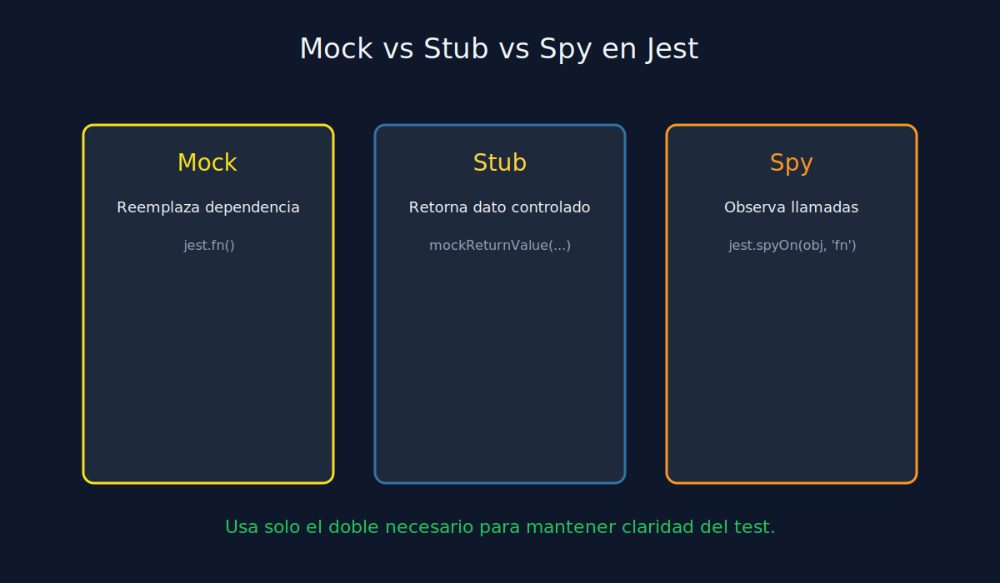
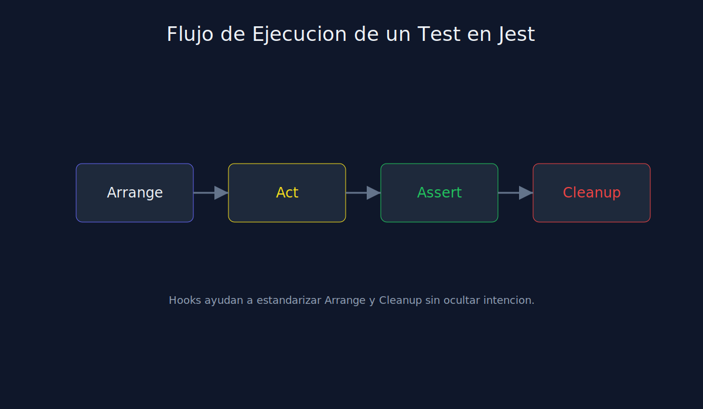

# 03 - Introduccion a Mocks, Stubs y Spies

**Tipo**: JavaScript (Jest)



## Diferencias esenciales

- **Mock**: reemplaza una dependencia completa.
- **Stub**: devuelve datos controlados para un caso.
- **Spy**: observa llamadas sobre implementacion real o parcial.

## Ejemplos minimos

### Mock

```javascript
const sendEmail = jest.fn();
```

### Stub

```javascript
const repo = { findById: jest.fn().mockReturnValue({ id: 1, active: true }) };
```

### Spy

```javascript
const spy = jest.spyOn(logger, "info");
service.run();
expect(spy).toHaveBeenCalled();
```

## Criterios de uso

- Aisla colaboraciones externas en unit tests.
- No mockees todo por defecto; primero identifica la dependencia critica.
- Verifica comportamiento observable, no detalles internos irrelevantes.


