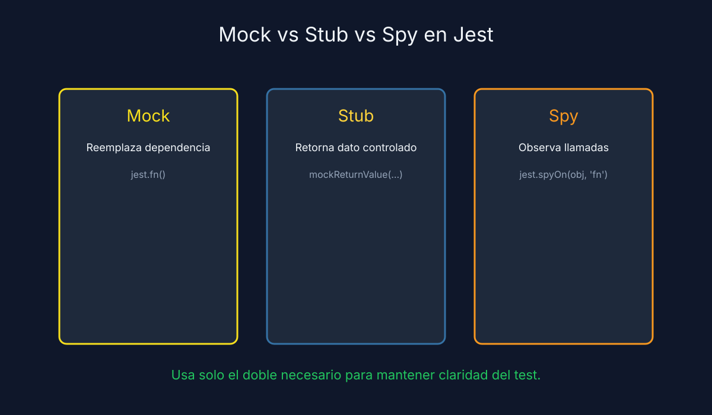
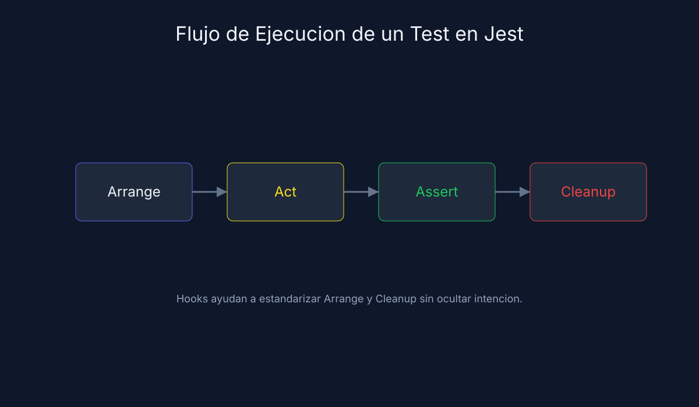

# 03 - Introducción a Mocks, Stubs y Spies

**Tipo**: JavaScript (Jest)



---

## Por qué existen

Un test unitario no debería depender de una base de datos real, un servicio externo o un temporizador del sistema. Los test doubles reemplazan esas dependencias por versiones controladas, para que el test sea rápido, repetible y aislado. Esta semana solo se ve el nivel introductorio (`jest.fn` y `jest.spyOn` básicos). Los timers falsos se ven en la Semana 09 y el mocking avanzado (matchers de mocks, módulos completos mockeados, mocks parciales) se profundiza en la Semana 10.

---

## Diferencias esenciales

- **Mock**: reemplaza una dependencia completa y permite verificar cómo fue llamada (cuántas veces, con qué argumentos).
- **Stub**: devuelve datos controlados para un caso específico, sin que el test le importe si fue llamado o no.
- **Spy**: observa llamadas sobre una implementación real o parcial, dejando que el código original siga corriendo si no se le indica lo contrario.

---

## Ejemplos mínimos

### Mock

```javascript
const sendEmail = jest.fn();

service.notify(sendEmail);

expect(sendEmail).toHaveBeenCalledTimes(1);
```

El foco está en la llamada misma: cuántas veces se invocó y con qué datos.

### Stub

```javascript
const repo = { findById: jest.fn().mockReturnValue({ id: 1, active: true }) };

const exhibit = repo.findById(1);

expect(exhibit.active).toBe(true);
```

El foco está en el dato devuelto: el test no verifica si `findById` fue llamado, solo usa lo que retorna.

### Spy

```javascript
const spy = jest.spyOn(logger, "info");
service.run();
expect(spy).toHaveBeenCalled();
```

`logger.info` sigue ejecutando su código real; `spy` solo agrega observabilidad encima. Como `jest.spyOn` modifica un objeto real, hay que restaurarlo al terminar para no contaminar otros tests:

```javascript
afterEach(() => {
  jest.restoreAllMocks(); // equivale a spy.mockRestore() en cada spy creado con spyOn
});
```

---

## Cuándo se parecen y cuándo no

Con `jest.fn()` se puede tanto verificar llamadas (uso de mock) como devolver datos fijos (uso de stub); la diferencia está en la intención del test, no en la API usada. Un mismo `jest.fn()` actúa como stub si el test solo lee su valor de retorno, y como mock si el test hace `expect(fn).toHaveBeenCalledWith(...)`.

`jest.spyOn` se distingue de ambos porque por defecto no reemplaza el comportamiento: envuelve la función real. Solo se vuelve un stub o mock si además se le encadena `.mockImplementation()` o `.mockReturnValue()`.

| Pregunta que responde el test | Double recomendado |
|---|---|
| "¿Que devolvió la dependencia?" | Stub |
| "¿Se llamó con estos argumentos?" | Mock |
| "¿La función real se ejecutó, y además se llamó?" | Spy |

---

## Criterios de uso

- Aísla colaboraciones externas en unit tests (red, disco, tiempo, servicios de terceros).
- No mockees todo por defecto; primero identifica la dependencia crítica que hace el test lento o no determinista.
- Verifica comportamiento observable, no detalles internos irrelevantes.
- Si el test necesita tanto un dato controlado como confirmar la llamada, usar mock (un stub que además se puede assertar con `toHaveBeenCalled`).

---

## Errores frecuentes a este nivel

- Confundir "usé `jest.fn()`" con "usé un mock": el nombre del double depende de que verifica el test, no de la función de Jest usada para crearlo.
- Usar un spy cuando en realidad se necesita reemplazar el comportamiento (la función real corre y produce efectos secundarios no deseados en el test).
- Verificar `toHaveBeenCalled` sobre un stub que solo debería aportar datos, acoplando el test a un detalle de implementación que no aporta valor.


