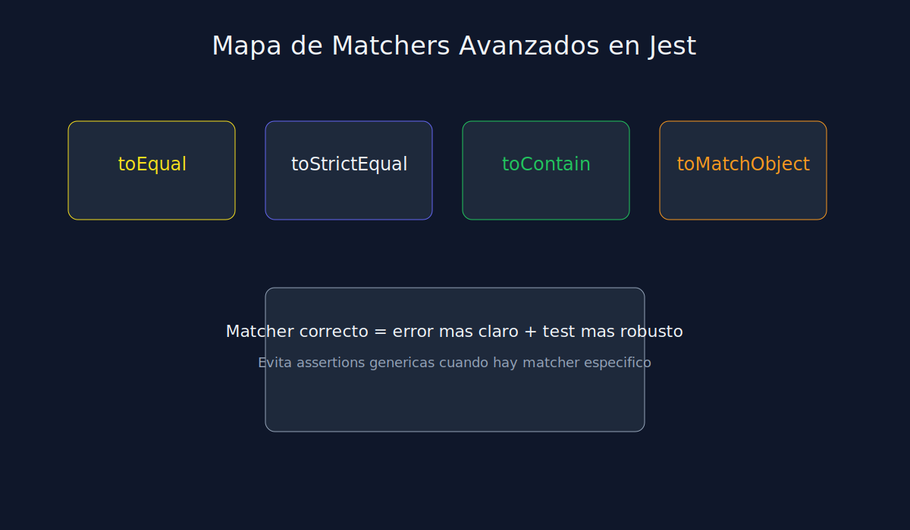
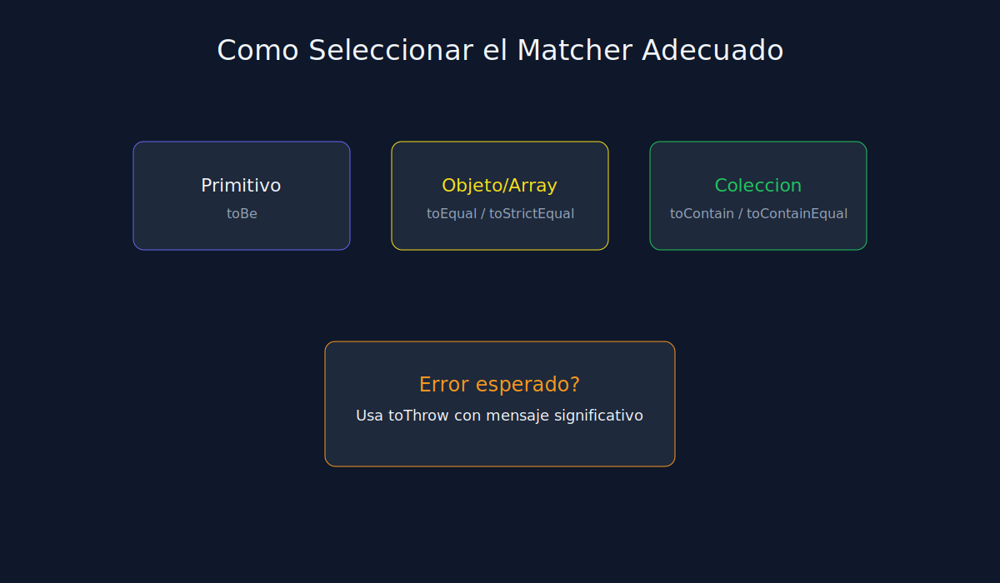

# 01 - Matchers Avanzados en Jest

**Tipo**: JavaScript (Jest)



## Objetivo

Elegir el matcher correcto para expresar mejor la intencion del test.

## Matchers clave

- `toEqual`: compara estructura y valores.
- `toStrictEqual`: compara estructura, valores y tipos de forma estricta.
- `toContain`: valida inclusion de valor en string/array.
- `toContainEqual`: valida inclusion por igualdad profunda en arrays de objetos.
- `toMatchObject`: valida parcialmente propiedades de un objeto.

## Ejemplos

```javascript
expect({ a: 1, b: 2 }).toMatchObject({ a: 1 });
expect([{ id: 1 }]).toContainEqual({ id: 1 });
expect(user.tags).toContain("premium");
```

## Regla practica

Un matcher preciso reduce falsos positivos y mejora lectura en revisiones.


