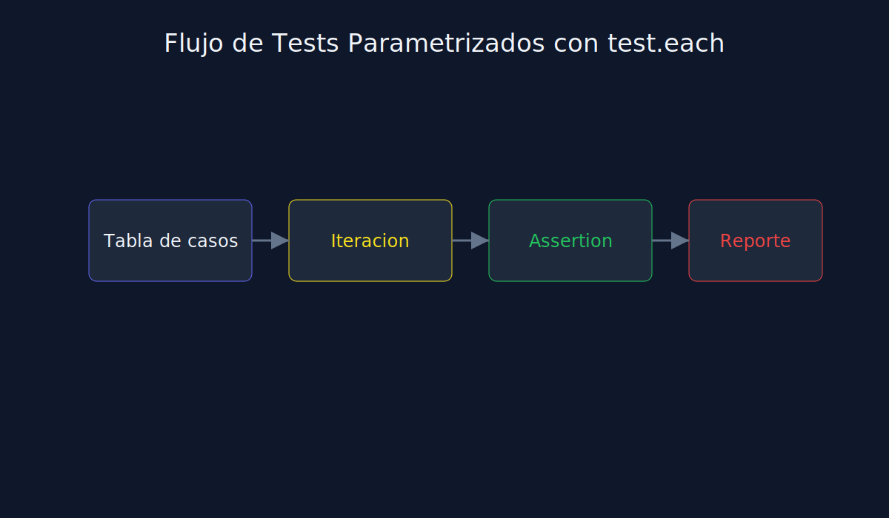

# 02 - Tests Parametrizados con `test.each`

**Tipo**: JavaScript (Jest)



## Por que parametrizar

Cuando varios tests solo cambian datos de entrada/salida, `test.each` evita duplicacion.

## Patron base

```javascript
test.each([
  [10, 2, 5],
  [9, 3, 3],
  [0, 1, 0]
])("should divide %i by %i and return %i", (a, b, expected) => {
  expect(divide(a, b)).toBe(expected);
});
```

## Beneficios

1. Menos codigo repetido.
2. Cobertura de mas combinaciones rapidamente.
3. Errores mas faciles de detectar por fila de datos.

## Buenas practicas

- Nombra bien cada fila/caso.
- Mantiene pocas columnas por tabla.
- Combina `test.each` con AAA de forma explicita.
