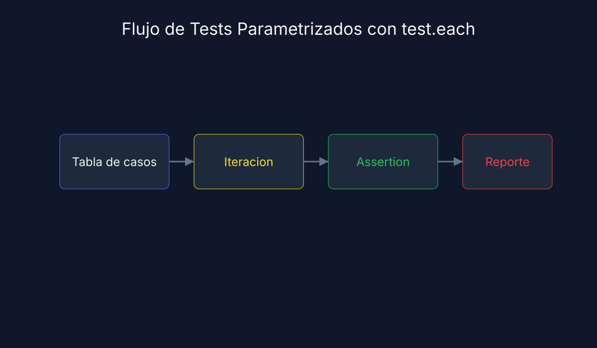

# 02 - Tests Parametrizados con `test.each`

**Tipo**: JavaScript (Jest)



---

## Por qué parametrizar

Cuando varios tests solo cambian datos de entrada/salida, `test.each` evita duplicación y hace explícita la tabla de casos que el código debe cumplir.

---

## Sintaxis: array de arrays

Cada fila es un array posicional; los valores se desestructuran como argumentos de la función de test.

```javascript
test.each([
  [10, 2, 5],
  [9, 3, 3],
  [0, 1, 0],
])("should divide %i by %i and return %i", (a, b, expected) => {
  expect(divide(a, b)).toBe(expected);
});
```

Los placeholders `%i` (entero), `%s` (string) y `%d` (número) en el título se reemplazan en orden con los valores de la fila, así cada caso aparece con nombre propio en el reporte.

---

## Sintaxis: template literal con tabla

Para casos con muchas columnas o datos con nombre, la tabla en template literal es más legible que arrays posicionales.

```javascript
test.each`
  ticketType   | basePrice | discount
  ${"general"} | ${20}     | ${0}
  ${"student"} | ${20}     | ${0.3}
  ${"senior"}  | ${20}     | ${0.5}
`("should apply $discount discount for $ticketType ticket", ({ ticketType, basePrice, discount }) => {
  expect(calculatePrice(ticketType, basePrice)).toBeCloseTo(basePrice * (1 - discount), 2);
});
```

Aquí los nombres de columna (`$ticketType`, `$discount`) se interpolan directo en el título del test, sin depender del orden posicional.

---

## Cuándo usar cada sintaxis

| Sintaxis | Conviene cuando... |
|---|---|
| Array de arrays | Pocos parámetros (2-4), tipos simples |
| Template literal | Muchas columnas, datos con nombre, mejor lectura tabular |

---

## Combinando con `describe.each`

`describe.each` parametriza un bloque completo, útil cuando varios tests comparten el mismo dato variable (por ejemplo, distintos tipos de visita a un planetario).

```javascript
describe.each(["general", "student", "senior"])("visit type: %s", (ticketType) => {
  test("should generate a valid ticket id", () => {
    expect(generateTicket(ticketType).id).toBeDefined();
  });

  test("should assign the correct ticket type", () => {
    expect(generateTicket(ticketType).type).toBe(ticketType);
  });
});
```

Cada combinación de `describe.each` crea su propio grupo en el reporte, así los fallos se ubican por tipo de visita sin leer todo el archivo.

---

## Beneficios

1. Menos código repetido.
2. Cobertura de más combinaciones rápidamente.
3. Errores más fáciles de detectar por fila de datos.
4. La tabla de casos documenta reglas de negocio (límites, descuentos, validaciones) en un solo lugar.

---

## Buenas prácticas

- Nombra bien cada fila/caso: usa `%s`/`%i` o interpolación `$campo`, nunca dejes el título genérico.
- Mantén pocas columnas por tabla; si crecen mucho, separa en varias tablas por escenario.
- Combina `test.each` con AAA de forma explícita: arrange de datos ya está en la fila, solo act y assert van en el cuerpo.
- Incluye casos límite (cero, negativos, vacíos) junto a los casos felices en la misma tabla.

---

## Errores frecuentes

- Mezclar array de arrays y template literal en el mismo archivo sin razón, dificulta la lectura.
- Usar `%s` para un número (el output se ve como texto), preferir `%i`/`%d` según el tipo.
- Tablas con 8+ columnas: señal de que el caso de prueba necesita dividirse.

---

## Regla práctica

Si copias y pegas un test cambiando solo un par de valores, esa es la señal para pasar a `test.each`.
