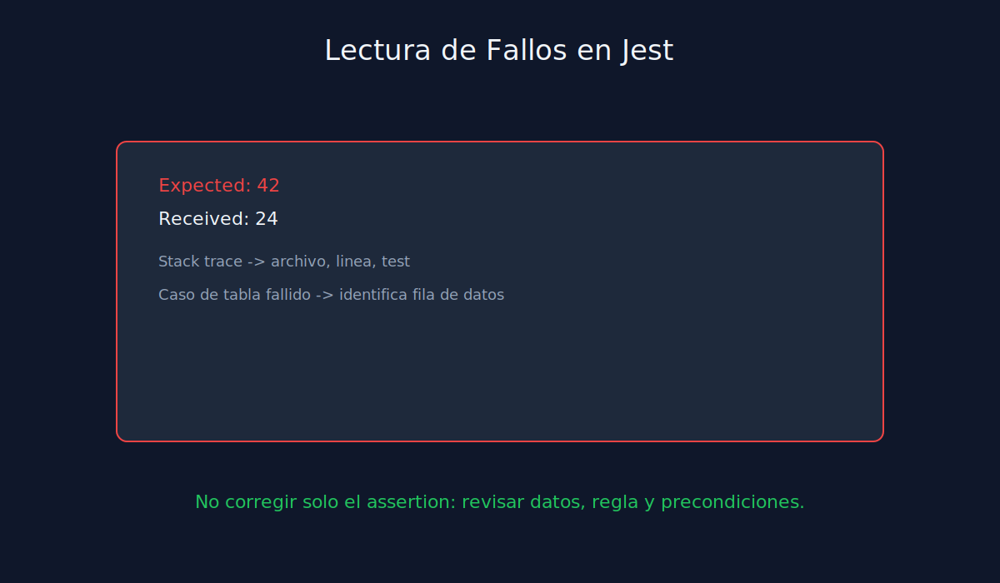
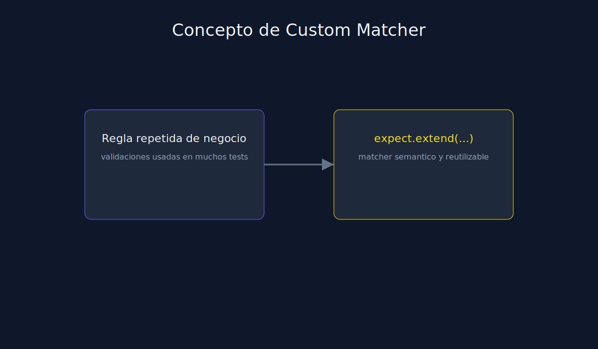

# 03 - Legibilidad de Assertions y Analisis de Fallos

**Tipo**: JavaScript (Jest)

## Objetivo

Escribir assertions faciles de entender y diagnosticar cuando fallan.

## Principios

- Un test debe tener una intencion principal.
- Evita mezclar muchas validaciones no relacionadas.
- Usa mensajes y nombres de test orientados a comportamiento.

## Estrategias

1. Separar escenarios por comportamiento.
2. Preferir matchers especificos antes que validaciones genericas.
3. Revisar diff del error para corregir causa raiz, no sintomas.

## Nota sobre custom matcher

Jest permite extender `expect` para casos recurrentes de negocio.

