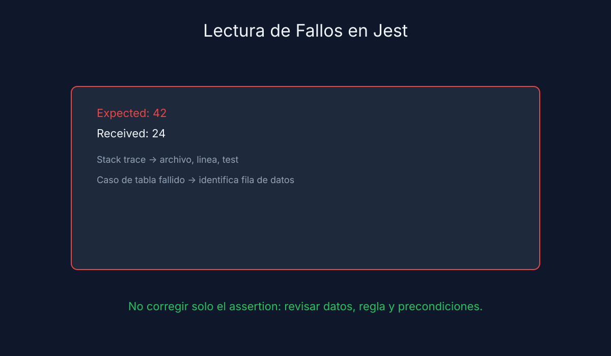
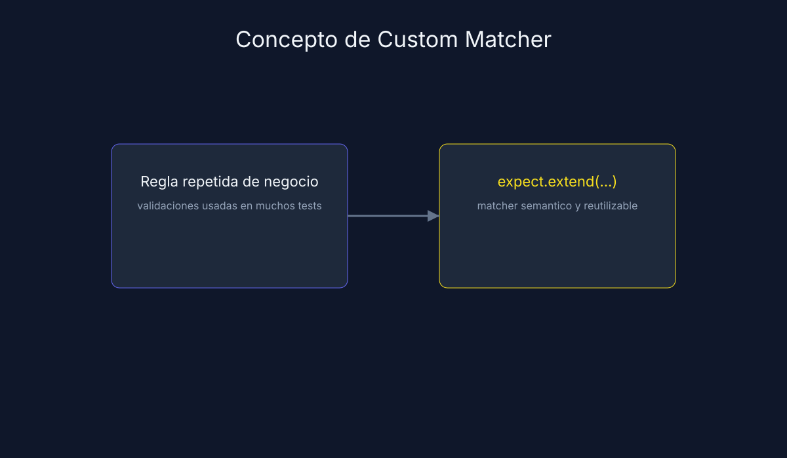

# 03 - Legibilidad de Assertions y Análisis de Fallos

**Tipo**: JavaScript (Jest)



---

## Objetivo

Escribir assertions fáciles de entender y diagnosticar cuando fallan, para que un fallo en CI se resuelva en minutos, no en una investigación larga.

---

## Principios

- Un test debe tener una intención principal.
- Evita mezclar muchas validaciones no relacionadas en un solo `test`.
- Usa mensajes y nombres de test orientados a comportamiento, no a implementación.

---

## Assertion pobre vs assertion clara

Mala: valida "algo pasó" sin decir qué exactamente se esperaba.

```javascript
test("should work", () => {
  const result = registerVisit("Museo Aeroespacial", 3);
  expect(result).toBeTruthy();
});
```

Si esto falla, el reporte solo dice que `result` fue falsy. No hay pista de qué campo está mal.

Buena: nombra el comportamiento y usa un matcher específico.

```javascript
test("should register a visit with the correct visitor count", () => {
  const result = registerVisit("Museo Aeroespacial", 3);

  expect(result).toMatchObject({ site: "Museo Aeroespacial", visitors: 3 });
});
```

Si falla, Jest muestra exactamente que propiedad no coincide, y el nombre del test ya describe la intención.

---

## Cómo leer un diff de fallo en Jest

Ante un fallo, Jest imprime tres bloques clave:

```
expect(received).toEqual(expected) // deep equality

- Expected  - 1
+ Received  + 1

  Object {
    "site": "Museo Aeroespacial",
-   "visitors": 3,
+   "visitors": 2,
  }
```

1. **Línea del matcher**: identifica qué comparación falló (`toEqual`, `toBe`, etc).
2. **`- Expected` / `+ Received`**: lo esperado va con `-`, lo real con `+`; se lee como un diff de git.
3. **Propiedad marcada**: solo la línea que difiere trae el signo; el resto del objeto se muestra igual para dar contexto. Jest ordena las claves alfabéticamente en el diff, así que no esperes ver el orden en que las escribiste.

La causa casi siempre está en la línea marcada, no en todo el bloque: revisa primero qué produjo ese valor antes de tocar el test.

---

## Assertion smells (señales de mal diseño)

| Smell | Síntoma | Corrección |
|---|---|---|
| Asserta demasiado | Un test valida 6+ propiedades sin relación | Dividir en tests por comportamiento |
| Asserta muy poco | Solo `toBeDefined()` o `toBeTruthy()` | Usar matcher específico (`toEqual`, `toHaveProperty`) |
| Assertion oculta en un helper | El fallo no dice qué helper la generó | Mover el `expect` al cuerpo del test |
| Test sin nombre de comportamiento | `test("caso 1", ...)` | Nombrar según el resultado esperado |
| Múltiples act antes de un solo assert | Dificulta saber qué acción causó el fallo | Un `act` por test, o parametrizar |

---

## Estrategias

1. Separar escenarios por comportamiento: un test, una razón para fallar.
2. Preferir matchers específicos antes que validaciones genéricas (`toBeTruthy`, `toBeDefined`).
3. Revisar el diff del error para corregir causa raíz, no síntomas: no cambies el `expected` solo para que pase.
4. Si un test necesita 3+ asserts distintos para tener sentido, evalúa si en realidad son 3 tests.

---

## Nota sobre custom matcher

Jest permite extender `expect` para casos recurrentes de negocio, cuando un mismo assertion complejo se repite en muchos archivos.

```javascript
expect.extend({
  toBeValidTicket(received) {
    const pass = typeof received.id === "string" && received.type !== undefined;
    return {
      pass,
      message: () => `expected ${JSON.stringify(received)} to be a valid ticket`,
    };
  },
});

expect(generateTicket("general")).toBeValidTicket();
```

---

## Regla práctica

Si al leer el nombre del test y el mensaje de fallo no puedes adivinar qué se rompió sin abrir el código fuente, la assertion necesita más precisión.


