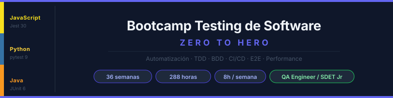

# Semana 08 - JavaScript Testing II: Matchers Avanzados y Parametrización

> **Etapa 1 - Testing con JavaScript** | Semana 8 de 15



---

## Objetivos de la Semana

Al finalizar esta semana serás capaz de:

1. Seleccionar matchers avanzados de Jest según tipo de dato y comportamiento esperado.
2. Diseñar tests parametrizados con `test.each` para reducir duplicación.
3. Mejorar legibilidad de assertions complejas en objetos, arrays y errores.
4. Mantener tests aislados y expresivos con patrón AAA.
5. Analizar fallos de assertions para depurar con mayor velocidad.
6. Consolidar una base robusta para testing asíncrono y mocking avanzado.

---

## Distribución del Tiempo (8 horas)

| Actividad | Contenido | Tiempo |
|---|---|---|
| Teoría | Matchers avanzados, parametrización y lectura de errores | 2.5 h |
| Prácticas | Ejercicios guiados con `test.each` y assertions complejas | 3 h |
| Proyecto | Suite del dominio con casos parametrizados | 2 h |
| Recursos y cierre | Refuerzo y checklist final | 0.5 h |

---

## Contenido de la Semana

### Teoría

1. [Matchers avanzados en Jest](./1-teoria/01-matchers-avanzados-jest.md)
2. [Tests parametrizados con `test.each`](./1-teoria/02-tests-parametrizados-jest.md)
3. [Legibilidad de assertions y análisis de fallos](./1-teoria/03-legibilidad-assertions-y-fallos.md)

### Prácticas

- [Ejercicio 01 - Matchers avanzados](./2-practicas/ejercicio-01-matchers-avanzados/)
- [Ejercicio 02 - Parametrización con `test.each`](./2-practicas/ejercicio-02-parametrizacion-test-each/)

### Proyecto

- [Proyecto semanal: Suite parametrizada del dominio](./3-proyecto/README.md)

### Recursos

- [Ebooks gratuitos](./4-recursos/ebooks-free/README.md)
- [Videografía](./4-recursos/videografia/README.md)
- [Webgrafía](./4-recursos/webgrafia/README.md)

### Glosario

- [Términos clave de la semana](./5-glosario/README.md)

---

## Estructura de Carpetas

```
week-08-matchers_avanzados_y_parametrizacion/
|-- README.md
|-- rubrica-evaluacion.md
|-- 0-assets/
|   |-- 01-mapa-matchers-avanzados.svg
|   |-- 02-flujo-test-each.svg
|   |-- 03-seleccion-matchers.svg
|   |-- 04-custom-matcher-concepto.svg
|   `-- 05-analisis-fallo-jest.svg
|-- 1-teoria/
|   |-- 01-matchers-avanzados-jest.md
|   |-- 02-tests-parametrizados-jest.md
|   `-- 03-legibilidad-assertions-y-fallos.md
|-- 2-practicas/
|   |-- ejercicio-01-matchers-avanzados/
|   `-- ejercicio-02-parametrizacion-test-each/
|-- 3-proyecto/
|   |-- README.md
|   `-- starter/
|-- 4-recursos/
|   |-- ebooks-free/README.md
|   |-- videografia/README.md
|   `-- webgrafia/README.md
`-- 5-glosario/
    `-- README.md
```

---

## Nota Importante

Esta semana apunta a escribir menos código repetido y más intención de prueba. Un buen matcher y una buena tabla de casos hacen la suite más mantenible.

---

## Navegación

| <- Semana anterior | Siguiente semana -> |
|---|---|
| [Semana 07 - Jest avanzado y organización](../week-07-jest_avanzado_y_organizacion_de_suites/README.md) | [Semana 09 - Testing asíncrono con Jest](../week-09-testing_asincrono_con_jest/README.md) |
