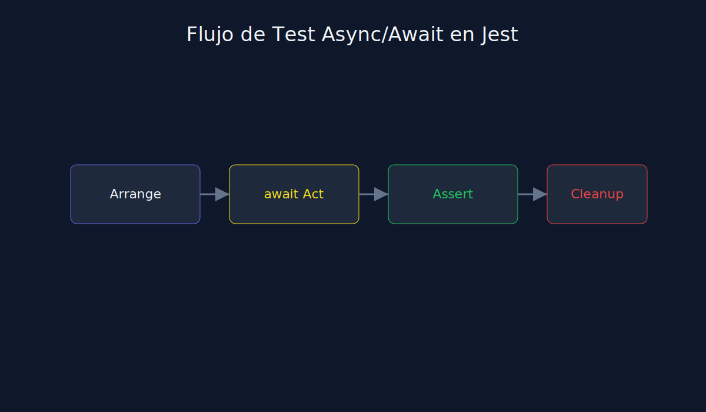

# 01 - Promesas y Async/Await en Testing con Jest

**Tipo**: JavaScript (Jest)



## Objetivo

Asegurar que cada test espere correctamente la operacion asincrona antes de validar.

## Patrones correctos

```javascript
test("should resolve user data when id exists", async () => {
  const result = await getUserById(1);
  expect(result).toMatchObject({ id: 1 });
});
```

```javascript
test("should resolve user data with resolves helper", async () => {
  await expect(getUserById(1)).resolves.toMatchObject({ id: 1 });
});
```

## Error comun

Olvidar `await` o `return` en una Promise y obtener un falso positivo.

## Regla practica

Si hay promesa, el test debe esperar explicitamente su cierre.
