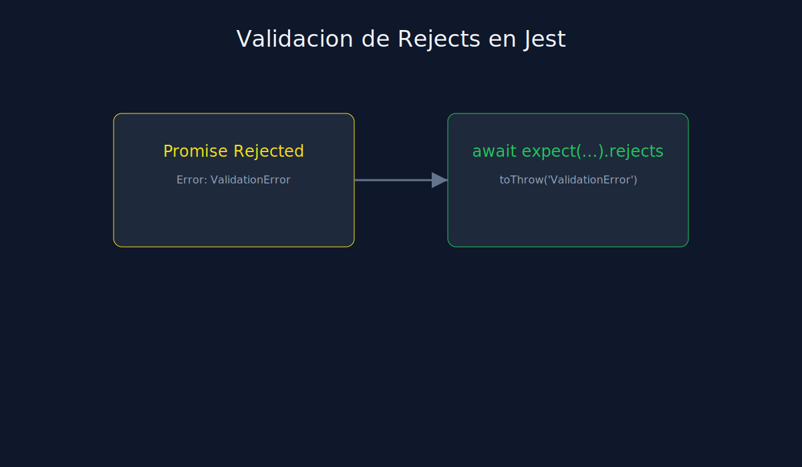

# 02 - Validacion de Errores Asincronos en Jest

**Tipo**: JavaScript (Jest)



## Objetivo

Comprobar fallos asincronos sin romper legibilidad ni enmascarar errores.

## Patron recomendado

```javascript
test("should reject when payload is invalid", async () => {
  await expect(createOrderAsync({})).rejects.toThrow("ValidationError");
});
```

## Alternativa con try/catch

```javascript
test("should reject with details", async () => {
  expect.assertions(1);
  try {
    await createOrderAsync({});
  } catch (error) {
    expect(error.message).toContain("ValidationError");
  }
});
```

## Nota

`rejects` suele ser mas claro cuando solo validas tipo o mensaje de error.
