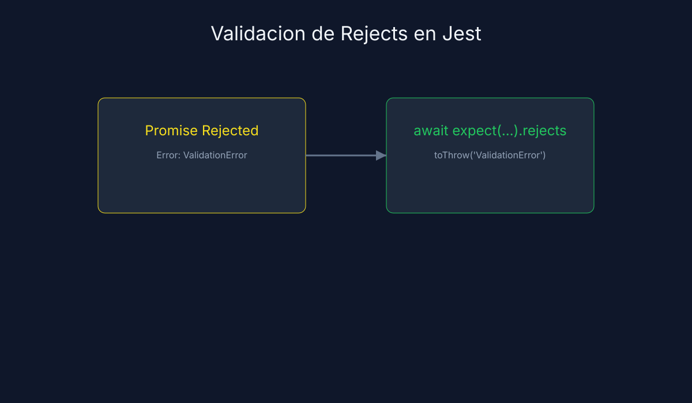
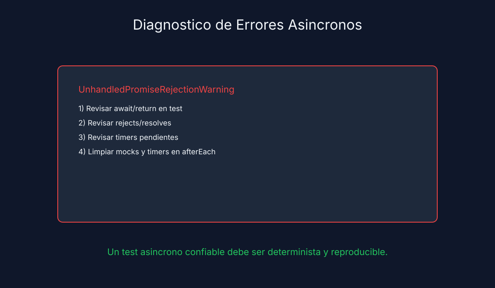

# 02 - Validación de Errores Asíncronos en Jest

**Tipo**: JavaScript (Jest)



---

## Objetivo

Comprobar fallos asíncronos sin romper legibilidad ni enmascarar errores, y evitar el falso positivo de un `catch` que nunca se ejecuta.

---

## Por qué un error asíncrono no se valida como uno síncrono

Un `throw` dentro de una función `async` no interrumpe el test como lo haría en código síncrono: se convierte en una Promise rechazada. Si el test no la espera con `rejects` o un `try/catch` correctamente instrumentado, el rechazo se pierde y el test pasa igual, haya o no haya fallado la función real.

---

## Patrón recomendado: `.rejects`

```javascript
test("should reject when payload is invalid", async () => {
  await expect(createTankRecordAsync({})).rejects.toThrow("ValidationError");
});
```

`rejects` es la forma más directa: en una línea valida que la Promise rechace y que el mensaje o tipo de error coincida.

---

## Alternativa con try/catch + expect.assertions

Cuando necesitas inspeccionar más de una propiedad del error, `try/catch` da más control, pero abre una trampa: si la función no rechaza, el bloque `catch` nunca corre y el test pasa sin haber validado nada.

```javascript
// MAL: si createTankRecordAsync no rechaza, el test pasa sin ejecutar ningún expect
test("should reject with details", async () => {
  try {
    await createTankRecordAsync({});
  } catch (error) {
    expect(error.message).toContain("ValidationError");
    expect(error.code).toBe(422);
  }
});
```

```javascript
// BIEN: expect.assertions(n) obliga a que se ejecuten exactamente n asserts
test("should reject with details", async () => {
  expect.assertions(2);
  try {
    await createTankRecordAsync({});
  } catch (error) {
    expect(error.message).toContain("ValidationError");
    expect(error.code).toBe(422);
  }
});
```

Si `createTankRecordAsync({})` dejara de rechazar por un bug, la versión con `expect.assertions(2)` falla porque se ejecutaron 0 asserts en vez de 2. La versión sin esa guarda pasaría en silencio.

---

## Mockeando rechazos con `mockRejectedValue`

```javascript
test("should propagate error from repository", async () => {
  const repository = {
    save: jest.fn().mockRejectedValue(new Error("ConnectionTimeout")),
  };

  await expect(saveSpecies(repository, { name: "otter" })).rejects.toThrow(
    "ConnectionTimeout"
  );
});
```

`mockRejectedValue` simula un fallo de dependencia (red, base de datos) sin depender del servicio real, manteniendo el test rápido y determinístico.

---

## Tabla comparativa

| Enfoque | Cuándo usarlo | Riesgo si se omite la guarda |
|---|---|---|
| `await expect(p).rejects.toThrow(...)` | Validar tipo/mensaje en una línea | Bajo: la aserción está implícita en el matcher |
| `try/catch` sin `expect.assertions` | Evitar este patrón | Alto: catch vacío pasa como test exitoso |
| `try/catch` con `expect.assertions(n)` | Validar múltiples propiedades del error | Bajo: Jest exige que se ejecuten `n` asserts |
| `jest.fn().mockRejectedValue(err)` | Simular fallo de una dependencia externa | Bajo, si se combina con `rejects` o `assertions` |

---

## Errores frecuentes



- Usar `try/catch` sin `expect.assertions(n)`: el test pasa aunque la promesa nunca rechace.
- Olvidar `await` antes de `expect(promise).rejects`.
- Mockear la dependencia con `mockResolvedValue` cuando el escenario requiere `mockRejectedValue`.
- Validar solo el tipo de error sin revisar el mensaje, ocultando regresiones de contenido.

---

## Regla práctica

Si usas `try/catch` para validar un error asíncrono, agrega `expect.assertions(n)` al inicio del test. Sin esa guarda, un `catch` que nunca se ejecuta es indistinguible de un test exitoso.
