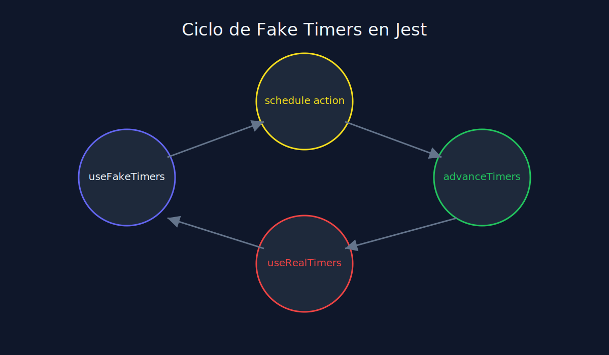
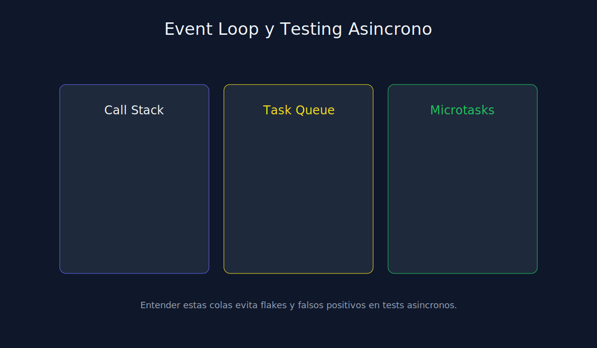

# 03 - Fake Timers y Control del Tiempo en Jest

**Tipo**: JavaScript (Jest)



## Objetivo

Hacer deterministas los tests que dependen de `setTimeout`, `setInterval` o reintentos.

## Ejemplo base

```javascript
beforeEach(() => {
  jest.useFakeTimers();
});

afterEach(() => {
  jest.useRealTimers();
});

test("should retry after 1000ms", () => {
  const callback = jest.fn();
  scheduleRetry(callback);

  jest.advanceTimersByTime(1000);

  expect(callback).toHaveBeenCalledTimes(1);
});
```

## Buenas practicas

1. Activar fake timers solo donde sea necesario.
2. Restaurar timers reales al final de cada test.
3. Combinar con mocks para validar cantidad de reintentos.


