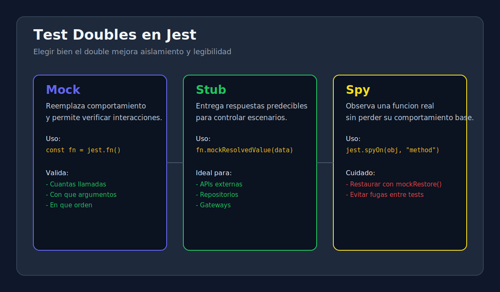

# 01 - Test Doubles en Jest: Mock, Stub y Spy

> **Lenguaje:** JavaScript (Jest)



---

## Objetivo

Entender que problema resuelve cada tipo de test double y elegirlo con criterio.

---

## Que es un test double

Un test double es una version controlada de una dependencia real. Su funcion principal es aislar la unidad bajo prueba para validar comportamiento sin depender de sistemas externos.

---

## Diferencias clave

| Tipo | Proposito | Ejemplo en Jest |
|---|---|---|
| Mock | Reemplazar y verificar interacciones | `const fn = jest.fn()` |
| Stub | Retornar datos predecibles | `fn.mockResolvedValue(data)` |
| Spy | Observar una funcion real sin reescribir toda la dependencia | `jest.spyOn(obj, "method")` |

---

## Ejemplo rapido

```javascript
const taxCalculator = {
  getRate(country) {
    if (country === "PE") return 0.18;
    return 0.2;
  },
};

test("should use spy to verify getRate call", () => {
  const rateSpy = jest.spyOn(taxCalculator, "getRate");

  const rate = taxCalculator.getRate("PE");

  expect(rate).toBe(0.18);
  expect(rateSpy).toHaveBeenCalledWith("PE");
  rateSpy.mockRestore();
});
```

---

## Regla practica de eleccion

1. Si solo necesitas respuestas controladas: usa stub.
2. Si necesitas validar cuantas veces o con que argumentos se invoca: usa mock.
3. Si quieres observar una implementacion existente sin perder su logica por defecto: usa spy.

---

## Errores frecuentes

- Mockear la funcion que realmente quieres validar.
- No restaurar spies y contaminar otros tests.
- Assertar demasiados detalles internos que cambian con refactors.
