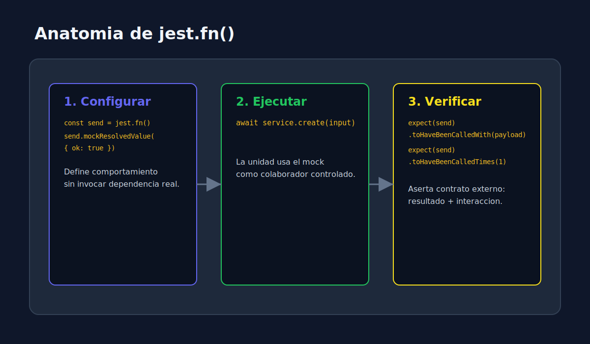
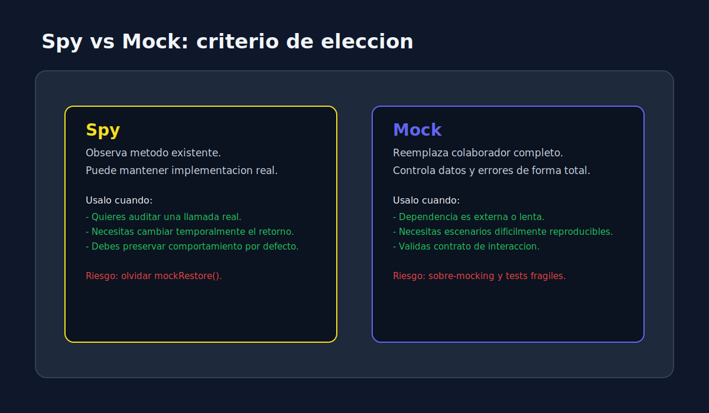

# 02 - Mocks de Funciones e Interacciones

> **Lenguaje:** JavaScript (Jest)




---

## Objetivo

Validar comportamiento observable: llamadas, argumentos, orden e impacto en la salida.

---

## Patron recomendado

1. **Arrange**: crear dependencia mockeada y configurar retorno.
2. **Act**: ejecutar unidad bajo prueba.
3. **Assert**: validar resultado + interaccion minima necesaria.

---

## Ejemplo de servicio

```javascript
async function sendWelcomeEmail(user, emailClient) {
  if (!user?.email) {
    throw new Error("email is required");
  }

  await emailClient.send({
    to: user.email,
    subject: "Welcome",
  });

  return { sent: true };
}

test("should call email client with expected payload", async () => {
  const emailClient = {
    send: jest.fn().mockResolvedValue({ ok: true }),
  };

  const result = await sendWelcomeEmail({ email: "a@demo.com" }, emailClient);

  expect(result).toEqual({ sent: true });
  expect(emailClient.send).toHaveBeenCalledTimes(1);
  expect(emailClient.send).toHaveBeenCalledWith({
    to: "a@demo.com",
    subject: "Welcome",
  });
});
```

---

## Matchers mas utiles para interacciones

- `toHaveBeenCalled()`
- `toHaveBeenCalledTimes(n)`
- `toHaveBeenCalledWith(payload)`
- `toHaveBeenNthCalledWith(n, payload)`
- `toHaveBeenLastCalledWith(payload)`

---

## Buenas practicas

- Verifica solo interacciones relevantes para el comportamiento.
- Evita asserts redundantes sobre implementacion interna.
- Limpia mocks con `jest.clearAllMocks()` en `afterEach` cuando aplique.
