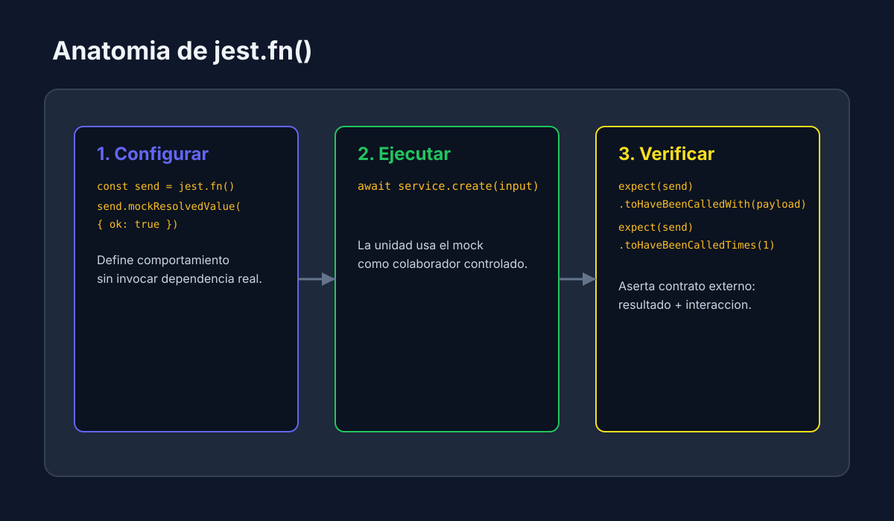
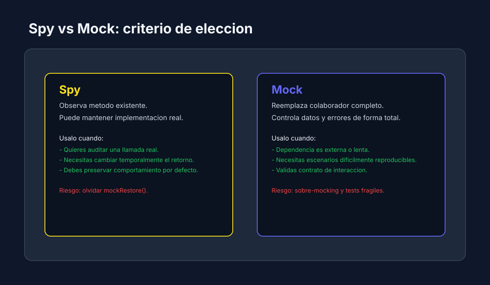

# 02 - Mocks de Funciones e Interacciones

> **Lenguaje:** JavaScript (Jest)




---

## Objetivo

Validar comportamiento observable: llamadas, argumentos, orden e impacto en la salida.

---

## Patron recomendado

1. **Arrange**: crear dependencia mockeada y configurar retorno.
2. **Act**: ejecutar unidad bajo prueba.
3. **Assert**: validar resultado + interaccion minima necesaria.

---

## Ejemplo de servicio

En la Semana 07 viste `jest.fn()` con `mockReturnValue` para un envio simple. Aqui el doble calcula su respuesta con `mockImplementation` y el test verifica tambien el orden de las llamadas.

```javascript
async function notifyWaitlist(visitors, smsClient) {
  const results = [];
  for (const visitor of visitors) {
    results.push(await smsClient.send(visitor.phone, `Hola ${visitor.name}, hay cupo en el Acuario`));
  }
  return results.filter((result) => result.ok).length;
}

test("should notify visitors in waitlist order and count deliveries", async () => {
  const smsClient = {
    send: jest.fn().mockImplementation(async (phone) => ({ ok: phone !== "000" })),
  };
  const visitors = [
    { name: "Ana", phone: "111" },
    { name: "Luis", phone: "000" },
  ];

  const delivered = await notifyWaitlist(visitors, smsClient);

  expect(delivered).toBe(1);
  expect(smsClient.send).toHaveBeenNthCalledWith(1, "111", "Hola Ana, hay cupo en el Acuario");
  expect(smsClient.send).toHaveBeenNthCalledWith(2, "000", "Hola Luis, hay cupo en el Acuario");
});
```

`mockImplementationOnce(fn)` sobrescribe solo la siguiente llamada; despues el mock vuelve a su implementacion por defecto.

---

## Matchers mas utiles para interacciones

- `toHaveBeenCalled()`
- `toHaveBeenCalledTimes(n)`
- `toHaveBeenCalledWith(payload)`
- `toHaveBeenNthCalledWith(n, payload)`
- `toHaveBeenLastCalledWith(payload)`

---

## Buenas practicas

- Verifica solo interacciones relevantes para el comportamiento.
- Evita asserts redundantes sobre implementacion interna.
- Limpia mocks con `jest.clearAllMocks()` en `afterEach` cuando aplique.

---

## Limpiar mocks: `mockClear`, `mockReset` y `mockRestore`

| Metodo | Historial de llamadas | Implementacion falsa | Metodo original |
|---|---|---|---|
| `mockClear()` / `jest.clearAllMocks()` | Se borra | Se conserva | No |
| `mockReset()` / `jest.resetAllMocks()` | Se borra | Se borra (devuelve `undefined`) | No |
| `mockRestore()` / `jest.restoreAllMocks()` | Se borra | Se borra | Se restaura (solo spies creados con `jest.spyOn`) |
