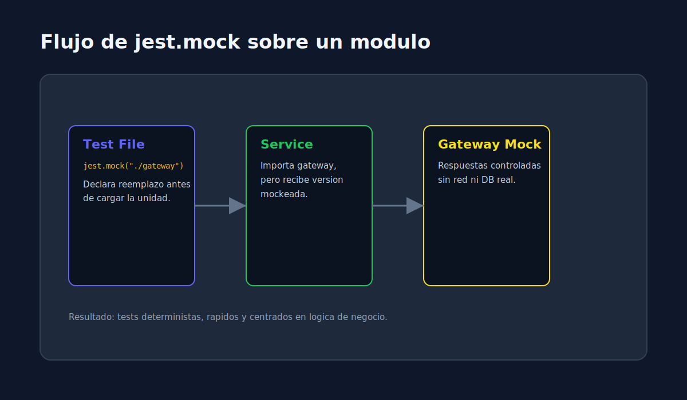

# 03 - Mocks de Modulos con jest.mock

> **Lenguaje:** JavaScript (Jest)



---

## Objetivo

Aislar dependencias de infraestructura (API, base de datos, correo, cache) para probar logica de negocio de forma deterministica.

---

## Cuando usar `jest.mock`

Usa `jest.mock("./dependency")` cuando quieras reemplazar un modulo completo importado por la unidad bajo prueba.

---

## Ejemplo basico

```javascript
// payment.gateway.js
async function charge(amount) {
  return { approved: amount < 1000 };
}

module.exports = { charge };

// order.service.js
const gateway = require("./payment.gateway");

async function processOrder(total) {
  const response = await gateway.charge(total);
  if (!response.approved) {
    throw new Error("payment rejected");
  }
  return { status: "confirmed" };
}

module.exports = { processOrder };
```

```javascript
// order.service.test.js
jest.mock("./payment.gateway", () => ({
  charge: jest.fn(),
}));

const gateway = require("./payment.gateway");
const { processOrder } = require("./order.service");

test("should confirm order when gateway approves charge", async () => {
  gateway.charge.mockResolvedValue({ approved: true });

  const result = await processOrder(200);

  expect(result).toEqual({ status: "confirmed" });
  expect(gateway.charge).toHaveBeenCalledWith(200);
});
```

---

## Riesgos comunes

- Mockear tanto que el test ya no refleja uso real.
- No resetear implementaciones entre tests.
- Acoplarse al orden interno de llamadas que no forma parte del contrato.

---

## Recomendacion

Combina unit tests con mocks + integration tests sin mocks en semanas siguientes para mantener balance en la piramide de testing.
