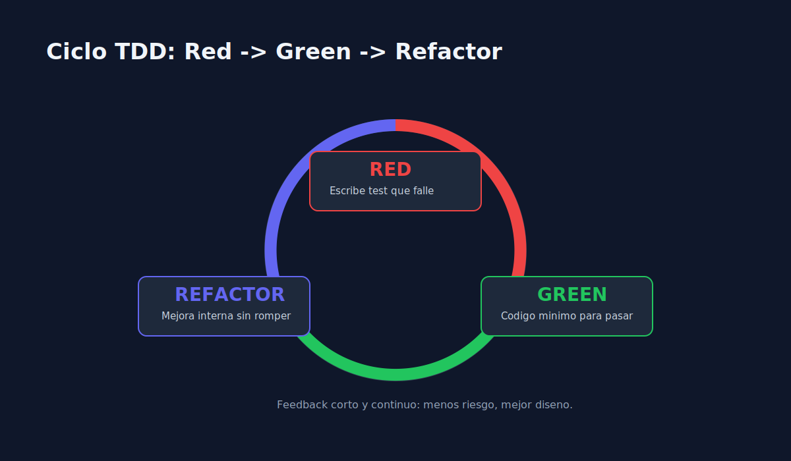

# 01 - Fundamentos del Ciclo Red-Green-Refactor

> **Lenguaje:** JavaScript (Jest)



---

## Objetivo

Dominar el ciclo base de TDD y su impacto en calidad y diseno.

---

## Fases del ciclo

1. **Red**: escribir un test que falle por la razon correcta.
2. **Green**: implementar el minimo codigo para que pase.
3. **Refactor**: mejorar estructura sin cambiar comportamiento.

---

## Ejemplo minimo

```javascript
test("should apply 10 percent discount when user is premium", () => {
  const result = calculateDiscount(100, "premium");
  expect(result).toBe(90);
});
```

- En **Red**, `calculateDiscount` aun no existe o no cumple.
- En **Green**, implementas logica minima.
- En **Refactor**, limpias nombres, duplicacion y legibilidad.

---

## Regla de oro

Si el test no falla primero, no tienes evidencia de que protege el comportamiento.

---

## Errores comunes

- Escribir varios tests antes de correr el primero.
- Implementar de mas en Green.
- Refactorizar cambiando comportamiento sin nuevos tests.
