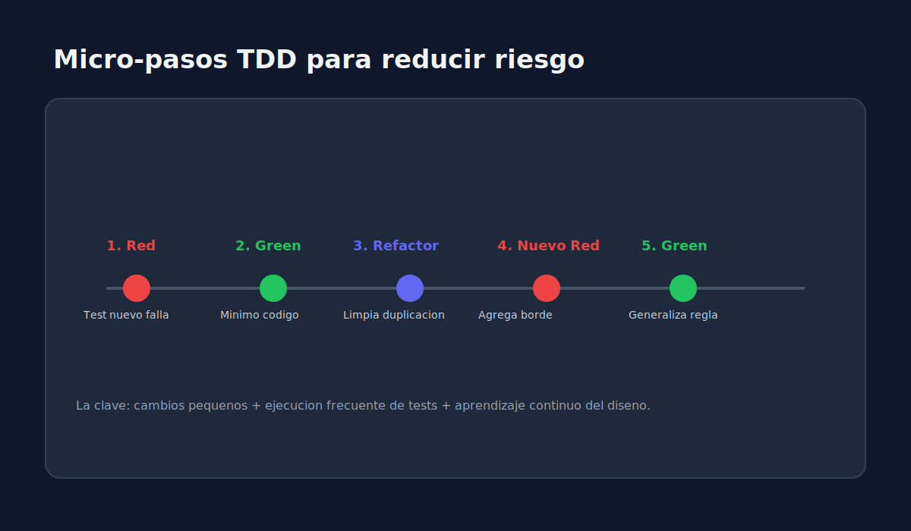
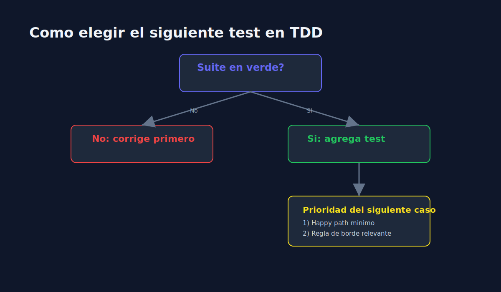

# 02 - Micro-ciclos TDD y Diseno Emergente

> **Lenguaje:** JavaScript (Jest)

---

## Objetivo

Reducir riesgo con pasos pequenos y decisiones guiadas por comportamiento.

---

## Por que micro-ciclos

Los micro-ciclos permiten feedback rapido, menor complejidad y deteccion temprana de problemas de diseno.

---

## Secuencia recomendada

1. Agrega un caso simple (happy path).
2. Hazlo pasar con implementacion minima.
3. Agrega un borde (input invalido).
4. Ajusta implementacion y refactoriza.
5. Repite.

---

## Patron de crecimiento

- De ejemplo concreto a regla general.
- De un escenario a variaciones controladas.
- De implementacion directa a abstracciones necesarias.

---

## Senales de buen diseno emergente

- Funciones pequenas y con responsabilidad clara.
- Menor acoplamiento entre modulos.
- Pruebas faciles de leer y mantener.
