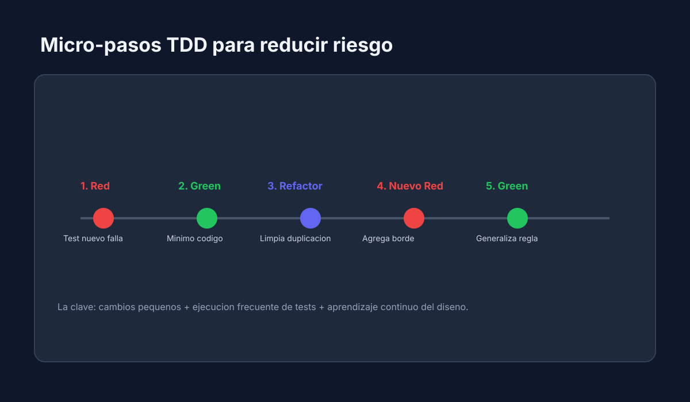
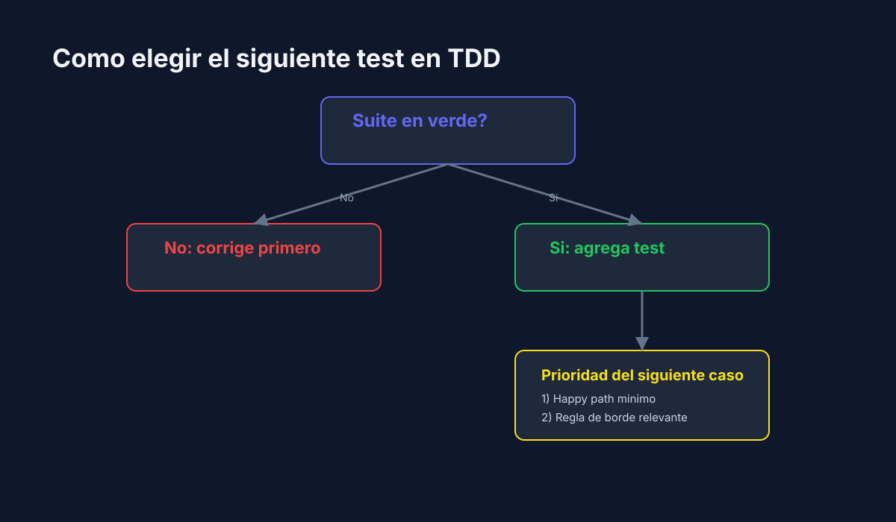

# 02 - Micro-ciclos TDD y Diseño Emergente

> **Lenguaje:** JavaScript (Jest)




---

## Objetivo

Reducir riesgo con pasos pequeños y decisiones guiadas por comportamiento.

---

## Por qué micro-ciclos

Los micro-ciclos permiten feedback rápido, menor complejidad y detección temprana de problemas de diseño.

---

## Secuencia recomendada

1. Agrega un caso simple (happy path).
2. Hazlo pasar con implementación mínima.
3. Agrega un borde (input inválido).
4. Ajusta implementación y refactoriza.
5. Repite.

---

## Patrón de crecimiento

- De ejemplo concreto a regla general.
- De un escenario a variaciones controladas.
- De implementación directa a abstracciones necesarias.

---

## Señales de buen diseño emergente

- Funciones pequeñas y con responsabilidad clara.
- Menor acoplamiento entre módulos.
- Pruebas fáciles de leer y mantener.

---

## Fake it till you make it

Técnica para el primer test: en Green, devuelves una constante que satisface el único caso conocido, sin construir lógica que ningún test exige aún. El próximo test obliga a generalizar.

```javascript
function admissionCategory(age) {
  return "infantil";
}
```

No es pereza, es evitar diseño especulativo: la lógica real la va a pedir el siguiente test, no la imaginación del autor.

---

## Triangulación: cada test empuja el diseño

Ejemplo: `admissionCategory(age)` debe clasificar visitantes de un planetario en `"infantil"`, `"adulto"` o `"senior"`.

### Test 1 - fake it

```javascript
test("should classify age 10 as infantil", () => {
  expect(admissionCategory(10)).toBe("infantil");
});
```

Implementación mínima (constante, ver sección anterior). Pasa, pero es obviamente incompleta.

### Test 2 - fuerza lógica real

```javascript
test("should classify age 30 as adulto", () => {
  expect(admissionCategory(30)).toBe("adulto");
});
```

La constante ya no alcanza. Un solo `if` no basta con dos categorías, así que aparece la primera condición real:

```javascript
function admissionCategory(age) {
  if (age < 18) return "infantil";
  return "adulto";
}
```

### Test 3 - triangula el borde que falta

```javascript
test("should classify age 65 as senior", () => {
  expect(admissionCategory(65)).toBe("senior");
});
```

Ahora el diseño se completa con el tercer caso, sin anticiparlo antes de tiempo:

```javascript
function admissionCategory(age) {
  if (age < 18) return "infantil";
  if (age < 60) return "adulto";
  return "senior";
}
```

Tres tests, tres decisiones de diseño, cada una motivada por un caso concreto y no por especulación. Eso es triangulación: el conjunto de tests "acorrala" la implementación hasta que la regla general emerge sola.

---

## Errores frecuentes

- Escribir la regla general completa en el primer Green, sin dejar que los tests la motiven.
- Agregar categorías o parámetros que ningún test pide todavía.
- Triangular con casos redundantes que no agregan una decisión de diseño nueva.
