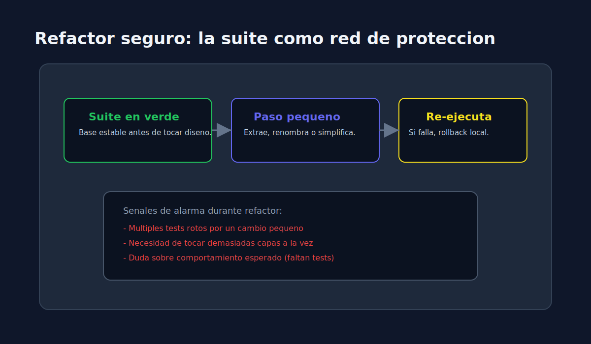

# 03 - Refactor Seguro con Respaldo de Tests

> **Lenguaje:** JavaScript (Jest)

---

## Objetivo

Refactorizar sin romper comportamiento observable gracias a una suite confiable.

---

## Refactor vs cambio funcional

- **Refactor**: mejora estructura interna manteniendo resultados externos.
- **Cambio funcional**: modifica reglas de negocio o salidas; requiere nuevos tests.

---

## Checklist antes de refactor

1. Suite actual en verde.
2. Casos criticos cubiertos.
3. Refactor en pasos pequenos.
4. Ejecutar tests despues de cada paso.

---

## Tecnicas utiles

- Extraer funcion para eliminar duplicacion.
- Renombrar con intencion de dominio.
- Separar validacion de transformacion.

---

## Anti patrones

- Refactor grande sin ejecutar tests intermedios.
- Cambiar API publica accidentalmente.
- Ignorar fallos "temporales" en suite.
