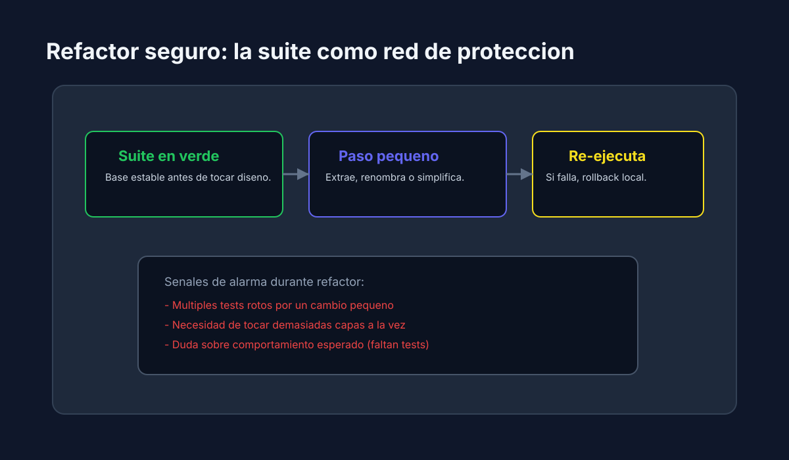

# 03 - Refactor Seguro con Respaldo de Tests

> **Lenguaje:** JavaScript (Jest)



---

## Objetivo

Refactorizar sin romper comportamiento observable gracias a una suite confiable.

---

## Refactor vs cambio funcional

- **Refactor**: mejora estructura interna manteniendo resultados externos.
- **Cambio funcional**: modifica reglas de negocio o salidas; requiere nuevos tests.

---

## Checklist antes de refactor

1. Suite actual en verde.
2. Casos críticos cubiertos.
3. Refactor en pasos pequeños.
4. Ejecutar tests después de cada paso.

---

## Técnicas útiles

- Extraer función para eliminar duplicación.
- Renombrar con intención de dominio.
- Separar validación de transformación.

---

## Anti patrones

- Refactor grande sin ejecutar tests intermedios.
- Cambiar API pública accidentalmente.
- Ignorar fallos "temporales" en suite.

---

## Ejemplo: extraer función y renombrar con la suite en verde

Un planetario calcula el precio final de una entrada aplicando descuento por categoría. La suite ya cubre el comportamiento:

```javascript
// pricing.test.js
const { finalPrice } = require("./pricing");

test("should apply no discount for adulto", () => {
  expect(finalPrice(20, "adulto")).toBe(20);
});

test("should apply 50 percent discount for infantil", () => {
  expect(finalPrice(20, "infantil")).toBe(10);
});

test("should apply 30 percent discount for senior", () => {
  expect(finalPrice(20, "senior")).toBe(14);
});
```

### Antes del refactor

```javascript
function finalPrice(base, category) {
  if (category === "infantil") {
    return base - base * 0.5;
  }
  if (category === "senior") {
    return base - base * 0.3;
  }
  return base;
}
```

Funciona, pero mezcla la tabla de descuentos con el cálculo. Se aplica **extracción de función** y un **renombrado** con intención de dominio, en pasos pequeños:

**Paso 1**: extraer la tasa de descuento a su propia función, correr tests (verde).

```javascript
function discountRateFor(category) {
  if (category === "infantil") return 0.5;
  if (category === "senior") return 0.3;
  return 0;
}

function finalPrice(base, category) {
  const rate = discountRateFor(category);
  return base - base * rate;
}
```

**Paso 2**: renombrar `rate` a `discountRate` para que el nombre exprese el dominio, correr tests otra vez (verde).

```javascript
function finalPrice(base, category) {
  const discountRate = discountRateFor(category);
  return base - base * discountRate;
}
```

Cada paso se validó con la suite antes de continuar. La API pública (`finalPrice(base, category)`) y su comportamiento observable no cambiaron en ningún momento.

---

## Por qué un refactor rompe tests (y cómo evitarlo)

| Causa | Síntoma | Prevención |
|---|---|---|
| Cambiar la firma de una función probada | Tests fallan por argumentos o valor de retorno distinto | Si cambia la firma, es cambio funcional: actualiza tests con intención, no "para que pase" |
| Extraer función y alterar un caso borde sin querer | Un test específico empieza a fallar | Ejecutar la suite completa después de cada paso pequeño, no al final |
| Renombrar sin actualizar mocks o spies que dependen del nombre original | Tests con `jest.spyOn` fallan porque el método ya no existe con ese nombre | Buscar todas las referencias antes de renombrar, incluidos tests |
| Tests acoplados a implementación interna (detalles, no comportamiento) | Cualquier refactor interno rompe tests aunque el resultado externo sea igual | Testear comportamiento observable, no estructura interna |

---

## Regla práctica

Si un refactor rompe un test, la primera pregunta es si cambiaste comportamiento por accidente. Si la respuesta es no, el test probablemente estaba acoplado a un detalle interno y merece revisarse.
