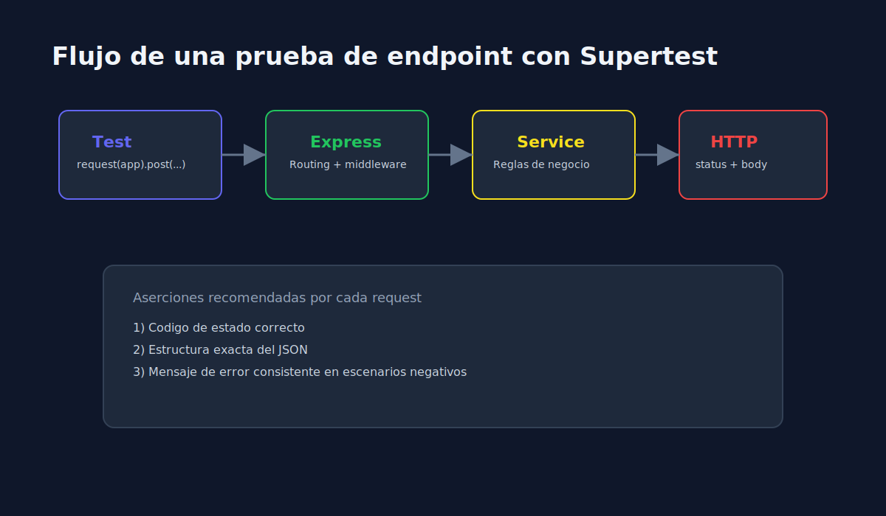

# 01 - Fundamentos de Testing de APIs REST con Supertest

> **Lenguaje:** JavaScript (Jest + Supertest)



---

## Objetivo

Entender como validar endpoints HTTP de forma automatizada y repetible.

---

## Que es Supertest

Supertest permite hacer requests HTTP contra una app de Express sin levantar servidor real en puerto, facilitando pruebas rapidas y aisladas.

---

## Patron base

```javascript
const request = require("supertest");
const { app } = require("./app");

test("should return health status", async () => {
  const response = await request(app).get("/health");

  expect(response.status).toBe(200);
  expect(response.body).toEqual({ status: "ok" });
});
```

---

## Que validar siempre

1. Codigo de estado HTTP.
2. Estructura y contenido del body.
3. Mensajes de error consistentes.
4. Headers relevantes cuando aplique.

---

## Errores comunes

- Probar API real externa en lugar de app local controlada.
- Validar solo `status` y omitir contrato de datos.
- No limpiar estado entre pruebas cuando hay almacenamiento en memoria.
