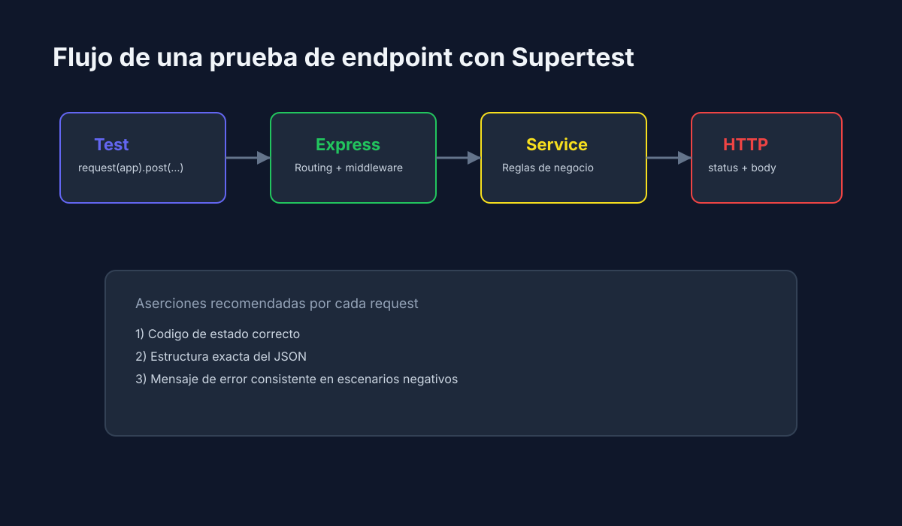

# 01 - Fundamentos de Testing de APIs REST con Supertest

> **Lenguaje:** JavaScript (Jest + Supertest)



---

## Objetivo

Entender como validar endpoints HTTP de forma automatizada y repetible.

---

## Qué es Supertest

Supertest permite hacer requests HTTP contra una app de Express sin levantar servidor real en puerto, facilitando pruebas rápidas y aisladas. Internamente usa `superagent` para construir la request y devuelve un objeto `response` con `status`, `body` y `headers` listos para assertar.

---

## Separar app y servidor

La app de Express se exporta sin invocar `listen()`. Así cada test importa la app directamente, sin abrir puertos reales ni pelear con conflictos de puerto en ejecución paralela.

Además, en vez de exportar una app ya construida, se exporta una **factory** `createApp()`. Cada llamada crea una app con su propio repositorio en memoria, de modo que un test nunca ve datos creados por otro.

```javascript
// app.js
const express = require("express");

function createApp() {
  const exhibits = [{ id: 1, name: "Sala de dinosaurios" }];

  const app = express();
  app.use(express.json());

  app.get("/health", (req, res) => res.json({ status: "ok" }));
  app.get("/exhibits", (req, res) => res.json(exhibits));
  app.post("/exhibits", (req, res) => {
    const created = { id: exhibits.length + 1, name: req.body.name };
    exhibits.push(created);
    res.status(201).json(created);
  });

  return app;
}

module.exports = { createApp };
```

```javascript
// server.js (solo para producción, no se importa en tests)
const { createApp } = require("./app");

createApp().listen(3000, () => console.log("API escuchando en :3000"));
```

---

## Patrón base

```javascript
const request = require("supertest");
const { createApp } = require("./app");

let app;

beforeEach(() => {
  app = createApp();
});

test("should return health status", async () => {
  const response = await request(app).get("/health");

  expect(response.status).toBe(200);
  expect(response.body).toEqual({ status: "ok" });
});
```

---

## Anatomía de un test con Supertest (AAA)

1. **Arrange**: preparar `app` y datos de entrada.
2. **Act**: disparar la request con `request(app).<verbo>(ruta)`.
3. **Assert**: validar `status`, `body` y, si aplica, `headers`.

```javascript
test("should return list of exhibits", async () => {
  const response = await request(app).get("/exhibits");

  expect(response.status).toBe(200);
  expect(response.body).toEqual([{ id: 1, name: "Sala de dinosaurios" }]);
});
```

---

## Matchers asimétricos para campos generados

Algunos campos los genera el servidor (ids, fechas) y el test no puede conocer su valor exacto. Jest ofrece **matchers asimétricos**: se colocan dentro de `toEqual` en lugar de un valor concreto y aceptan cualquier valor que cumpla una condición.

```javascript
test("should create exhibit with generated id", async () => {
  const response = await request(app)
    .post("/exhibits")
    .send({ name: "Sala de aves" });

  expect(response.body).toEqual({
    id: expect.any(Number), // cualquier number
    name: "Sala de aves", // valor exacto
  });
  // Solo exige que existan estas propiedades; ignora las demás.
  expect(response.body).toEqual(expect.objectContaining({ name: "Sala de aves" }));
});
```

- `expect.any(Constructor)`: cualquier valor de ese tipo (`String`, `Number`, `Date`...).
- `expect.objectContaining(obj)`: un objeto que contenga al menos esas propiedades.

---

## Qué validar siempre

1. Código de estado HTTP.
2. Estructura y contenido del body.
3. Mensajes de error consistentes.
4. Headers relevantes cuando aplique (`content-type`, `location`, etc.).

---

## Errores comunes

- Probar API real externa en lugar de app local controlada.
- Validar solo `status` y omitir contrato de datos.
- No limpiar estado entre pruebas cuando hay almacenamiento en memoria.
- Exportar la app con `listen()` ya invocado, forzando conflictos de puerto entre suites.
- Repetir lógica de arranque de `app` en cada archivo de test en lugar de centralizarla en un módulo común.
