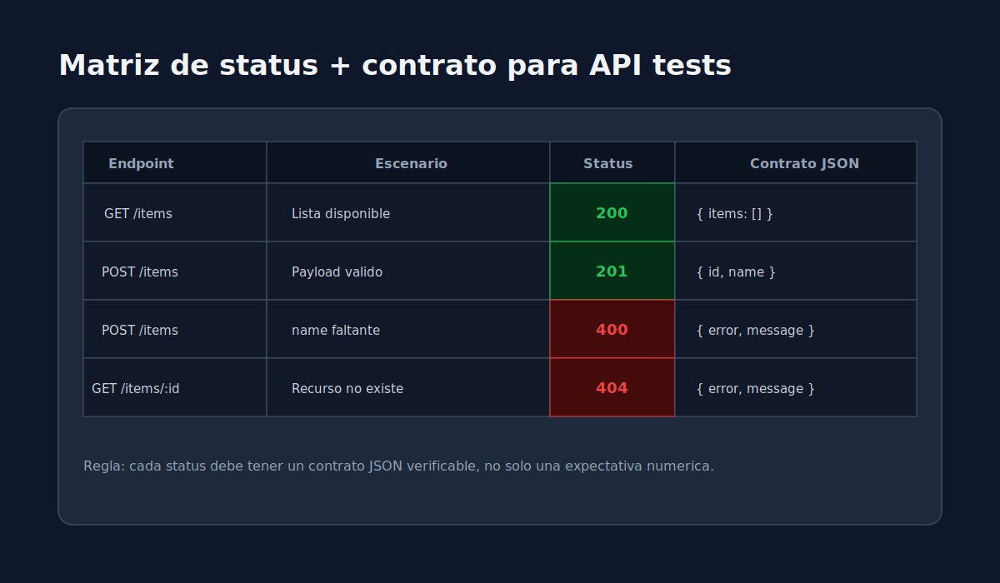
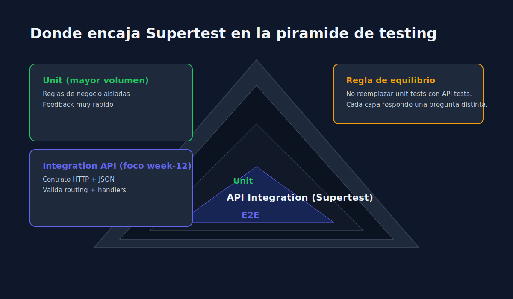

# 02 - Diseno de Casos HTTP y Contratos de Respuesta

> **Lenguaje:** JavaScript (Jest + Supertest)




---

## Objetivo

Diseñar casos de prueba que validen comportamiento funcional y contrato API.

---

## Matriz minima sugerida

| Endpoint | Caso | Status esperado |
|---|---|---|
| GET /items | lista disponible | 200 |
| POST /items | payload valido | 201 |
| POST /items | campo requerido faltante | 400 |
| GET /items/:id | item inexistente | 404 |

---

## Contrato de respuesta

Para cada endpoint, define explicitamente:

1. Shape del JSON de exito.
2. Shape del JSON de error.
3. Reglas de validacion de campos.

---

## Ejemplo de test de contrato

```javascript
test("should return validation error payload when name is missing", async () => {
  const response = await request(app).post("/items").send({});

  expect(response.status).toBe(400);
  expect(response.body).toEqual({
    error: "ValidationError",
    message: "name is required",
  });
});
```

---

## Recomendacion

Empieza por los endpoints de mayor impacto de negocio y evoluciona la matriz de casos en paralelo al desarrollo.
