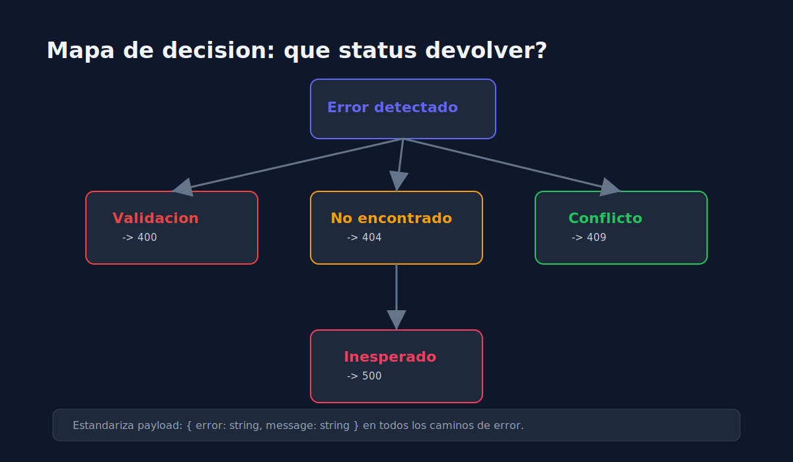

# 03 - Manejo de Errores y Estabilidad en API Tests

> **Lenguaje:** JavaScript (Jest + Supertest)



---

## Objetivo

Asegurar que la suite de API sea estable y diagnostique fallos con claridad.

---

## Tipos de errores frecuentes

1. **Validacion**: request invalido (400).
2. **No encontrado**: recurso inexistente (404).
3. **Conflicto**: duplicidad de datos (409).
4. **Interno**: excepcion no controlada (500).

---

## Estrategias de estabilidad

- Usar datos deterministas por test.
- Resetear estado de repositorio in-memory entre casos.
- Evitar dependencia de orden de ejecucion.
- Mantener asserts enfocados y descriptivos.

---

## Plantilla de error recomendada

```json
{
  "error": "ValidationError",
  "message": "name is required"
}
```

---

## Regla practica

Cuando un test de API falla, primero revisa si el contrato esperado sigue vigente antes de culpar al framework o al entorno.
