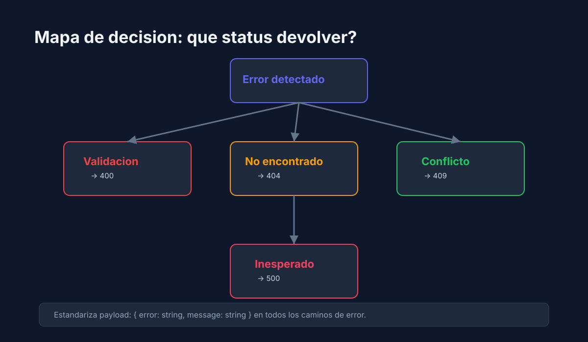

# 03 - Manejo de Errores y Estabilidad en API Tests

> **Lenguaje:** JavaScript (Jest + Supertest)



---

## Objetivo

Asegurar que la suite de API sea estable y diagnostique fallos con claridad.

---

## Tipos de errores frecuentes

1. **Validación**: request inválido (400).
2. **No encontrado**: recurso inexistente (404).
3. **Conflicto**: duplicidad de datos (409).
4. **Interno**: excepción no controlada (500).

---

## Estrategias de estabilidad

- Usar datos deterministas por test.
- Resetear estado de repositorio in-memory entre casos.
- Evitar dependencia de orden de ejecución.
- Mantener asserts enfocados y descriptivos.
- No compartir fixtures mutables entre archivos de test.

---

## Repositorio in-memory y reset entre tests

Cuando la app guarda datos en un arreglo o Map en memoria, cada test puede dejar el estado sucio para el siguiente. La solución es que `createApp()` construya el repositorio dentro de la factory y que `beforeEach` cree una app nueva antes de cada caso.

```javascript
// app.js
const express = require("express");

function createExhibitRepository() {
  const exhibits = [];

  return {
    findById: (id) => exhibits.find((exhibit) => exhibit.id === id),
    create: (name) => {
      const created = { id: exhibits.length + 1, name };
      exhibits.push(created);
      return created;
    },
  };
}

function createApp({ repository = createExhibitRepository() } = {}) {
  const app = express();
  app.use(express.json());
  // ...rutas que usan repository...
  return app;
}

module.exports = { createApp };
```

```javascript
// app.test.js
const request = require("supertest");
const { createApp } = require("./app");

let app;

beforeEach(() => {
  app = createApp(); // repositorio vacío en cada test
});

test("should create exhibit with unique id", async () => {
  const response = await request(app)
    .post("/exhibits")
    .send({ name: "Sala de aves" });

  expect(response.status).toBe(201);
  expect(response.body.id).toBeDefined();
});
```

---

## Testear un 404

```javascript
test("should return 404 when exhibit does not exist", async () => {
  const response = await request(app).get("/exhibits/999");

  expect(response.status).toBe(404);
  expect(response.body).toEqual({
    error: "NotFoundError",
    message: "exhibit not found",
  });
});
```

---

## Testear un 409

```javascript
test("should return 409 when exhibit name already exists", async () => {
  await request(app).post("/exhibits").send({ name: "Sala de aves" });

  const response = await request(app)
    .post("/exhibits")
    .send({ name: "Sala de aves" });

  expect(response.status).toBe(409);
  expect(response.body).toEqual({
    error: "ConflictError",
    message: "exhibit name already exists",
  });
});
```

---

## Testear un 500 con middleware de errores

En Express 5, una excepción lanzada en un handler (o una promesa rechazada) llega al **middleware de errores**, que se reconoce por tener 4 argumentos. Se registra al final, después de las rutas:

```javascript
// dentro de createApp, después de las rutas
app.get("/exhibits/:id", (req, res) => {
  const found = repository.findById(Number(req.params.id));
  // ...404 si no existe, 200 si existe...
});

app.use((err, req, res, next) => {
  res.status(500).json({
    error: "InternalServerError",
    message: "unexpected error",
  });
});
```

Para provocar el 500 de forma determinista se inyecta un repositorio que lanza:

```javascript
test("should return 500 when repository fails", async () => {
  const failingRepository = {
    findById: () => {
      throw new Error("database down");
    },
  };
  const failingApp = createApp({ repository: failingRepository });

  const response = await request(failingApp).get("/exhibits/1");

  expect(response.status).toBe(500);
  expect(response.body).toEqual({
    error: "InternalServerError",
    message: "unexpected error",
  });
});
```

El test verifica también que el mensaje interno (`database down`) no se filtra al cliente.

---

## Plantilla de error recomendada

```json
{
  "error": "ValidationError",
  "message": "name is required"
}
```

---

## Regla práctica

Cuando un test de API falla, primero revisa si el contrato esperado sigue vigente antes de culpar al framework o al entorno.

---

## Errores frecuentes

- Compartir un único array de datos a nivel de módulo entre tests en lugar de crear la app con `createApp()` en `beforeEach`.
- Asumir orden de ejecución entre tests para que un recurso "ya exista".
- Devolver 500 para errores de validación que deberían ser 400.
- No distinguir 404 (no existe) de 409 (conflicto con estado actual).
