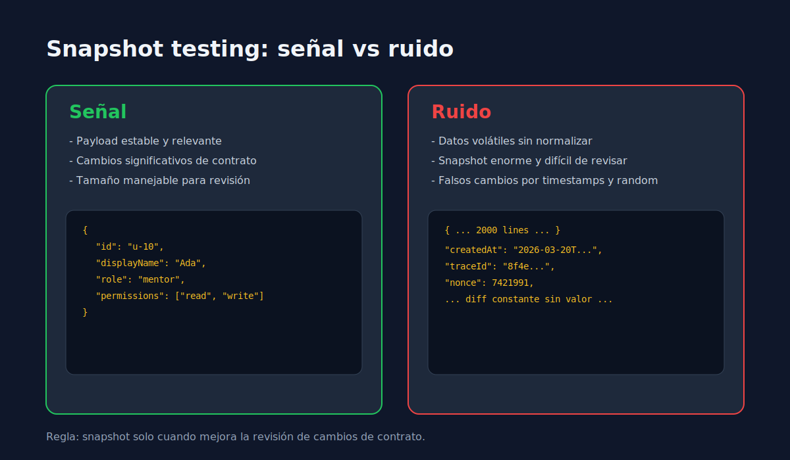

# 01 - Snapshot Testing con Intencion

> **Lenguaje:** JavaScript (Jest)



---

## Objetivo

Usar snapshots para detectar cambios relevantes sin generar mantenimiento innecesario.

---

## Cuando conviene snapshot

- Serializacion estable de salidas.
- Estructuras de respuesta con forma amplia pero controlada.
- Componentes o payloads donde importa estructura completa.

---

## Cuando evitarlo

- Datos con timestamps, ids random o campos volatiles sin normalizar.
- Objetos enormes que no expresan intencion de negocio.
- Casos donde una asercion explicita comunica mejor.

---

## Ejemplo

```javascript
test("should match public profile payload snapshot", () => {
  const payload = buildPublicProfile({
    id: "u-10",
    name: "Ada",
    role: "mentor",
  });

  expect(payload).toMatchSnapshot();
});
```

---

## Regla practica

Snapshot pequeño y estable > snapshot gigante que nadie revisa.
