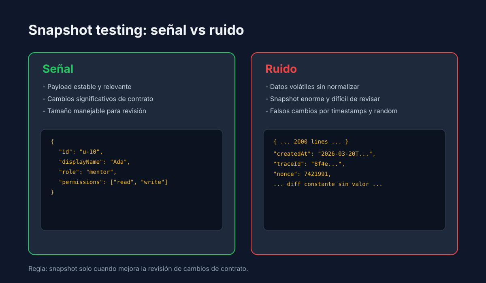

# 01 - Snapshot Testing con Intención

> **Lenguaje:** JavaScript (Jest)



---

## Objetivo

Usar snapshots para detectar cambios relevantes sin generar mantenimiento innecesario.

---

## Cuándo conviene snapshot

- Serialización estable de salidas.
- Estructuras de respuesta con forma amplia pero controlada.
- Componentes o payloads donde importa estructura completa.
- Salidas de renderizado (HTML, markup, texto formateado) que deben mantenerse estables entre releases.

---

## Cuándo evitarlo

- Datos con timestamps, ids random o campos volátiles sin normalizar.
- Objetos enormes que no expresan intención de negocio.
- Casos donde una aserción explícita comunica mejor.
- Payloads que cambian de forma en cada iteración del feature (todavía inestables).

---

## toMatchSnapshot vs toMatchInlineSnapshot

| Aspecto | `toMatchSnapshot()` | `toMatchInlineSnapshot()` |
|---|---|---|
| Almacenamiento | Archivo `__snapshots__/*.snap` separado | Dentro del propio archivo de test |
| Revisión en PR | Requiere abrir el `.snap` aparte | Visible directo en el diff del test |
| Uso recomendado | Snapshots grandes o muchos por archivo | Snapshots pequeños, 1-5 líneas |
| Actualización | `jest --updateSnapshot` reescribe el `.snap` | `jest --updateSnapshot` reescribe el literal inline |

```javascript
test("should format museum ticket code inline", () => {
  const code = formatTicketCode({ hall: "paleontologia", visitorType: "adulto" });

  expect(code).toMatchInlineSnapshot(`"PALEO-ADT"`);
});
```

Si el snapshot cabe en una línea y aporta valor de lectura inmediata en el PR, preferí inline. Si es una estructura grande (payload JSON completo, árbol de componentes), usa el archivo `.snap`.

---

## Snapshot amplio vs snapshot enfocado

**Demasiado amplio** — captura el objeto completo, incluye campos volátiles y no comunica que se está validando:

```javascript
test("should match exhibit payload snapshot (too broad)", () => {
  const exhibit = buildExhibitPayload({ id: "exh-04", title: "Sala de Ceramica" });

  // createdAt e internalId cambian en cada corrida -> snapshot frágil
  expect(exhibit).toMatchSnapshot();
});
```

**Enfocado** — se queda solo con los campos que expresan la regla de negocio bajo prueba:

```javascript
test("should match exhibit public summary snapshot", () => {
  const exhibit = buildExhibitPayload({ id: "exh-04", title: "Sala de Ceramica" });

  const { title, hall, isOpenToPublic } = exhibit;

  expect({ title, hall, isOpenToPublic }).toMatchSnapshot();
});
```

La segunda versión falla solo cuando cambia algo que le importa al negocio, no cuando cambia un `id` interno o un timestamp.

---

## Ejemplo

```javascript
test("should match public profile payload snapshot", () => {
  const payload = buildPublicProfile({
    id: "u-10",
    name: "Ada",
    role: "mentor",
  });

  expect(payload).toMatchSnapshot();
});
```

---

## Errores frecuentes

- Aceptar `--updateSnapshot` sin revisar el diff, "porque el test ya pasa".
- Meter el objeto completo de un ORM/DB en el snapshot en vez de proyectar solo los campos relevantes.
- Usar snapshot para validar un único valor primitivo (ahí una aserción directa es más clara).

---

## Regla práctica

Snapshot pequeño y estable > snapshot gigante que nadie revisa.
