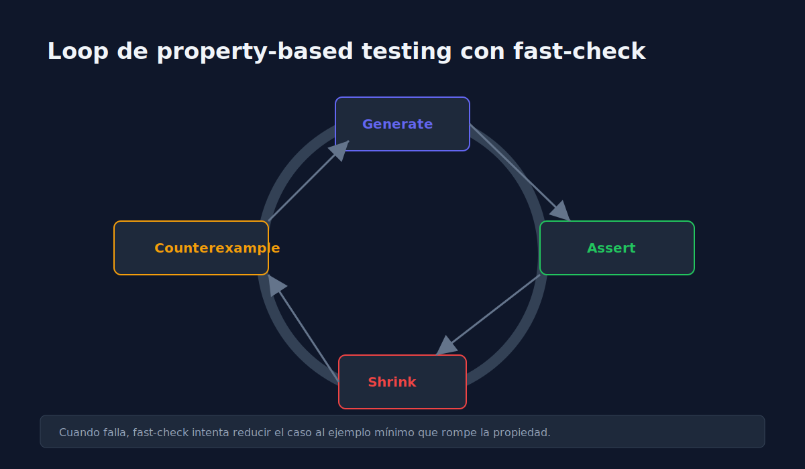

# 02 - Fundamentos de Property-Based Testing

> **Lenguaje:** JavaScript (Jest + fast-check)



---

## Objetivo

Validar reglas generales (propiedades) sobre muchos datos generados automaticamente.

---

## Idea central

En lugar de probar pocos ejemplos manuales, defines una propiedad que siempre debe cumplirse.

---

## Ejemplo de propiedad

```javascript
const fc = require("fast-check");

test("should keep list length after reverse twice", () => {
  fc.assert(
    fc.property(fc.array(fc.integer()), (values) => {
      const result = [...values].reverse().reverse();
      expect(result).toEqual(values);
    })
  );
});
```

---

## Beneficios

1. Explora variedad de inputs automaticamente.
2. Descubre casos extremos no previstos.
3. Entrega contraejemplos minimizados cuando falla.

---

## Cuidado

Una propiedad mal definida puede pasar siempre sin valor real.
