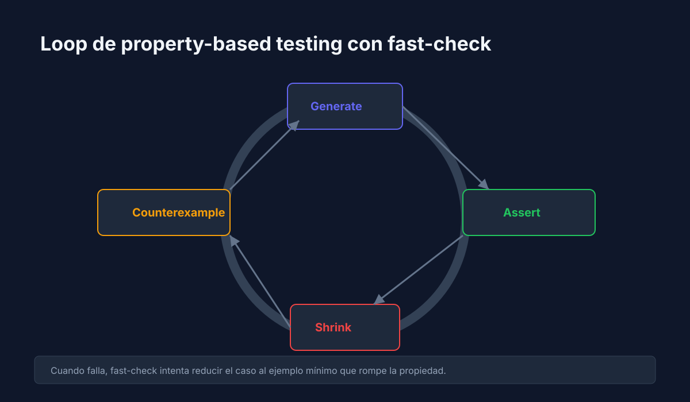

# 02 - Fundamentos de Property-Based Testing

> **Lenguaje:** JavaScript (Jest + fast-check)



---

## Objetivo

Validar reglas generales (propiedades) sobre muchos datos generados automáticamente.

---

## Idea central

En lugar de probar pocos ejemplos manuales, defines una propiedad que siempre debe cumplirse. El test-based clásico responde "¿funciona con este dato?"; el property-based responde "¿funciona con cualquier dato válido?".

---

## Example-based vs property: mismo código, dos enfoques

Función bajo prueba — ordena visitantes de un museo por hora de llegada:

```javascript
function sortByArrival(visitors) {
  return [...visitors].sort((a, b) => a.arrivalMinute - b.arrivalMinute);
}
```

**Example-based** — verifica un caso puntual, con datos elegidos a mano:

```javascript
test("should sort three visitors by arrival minute", () => {
  const visitors = [
    { name: "Rio", arrivalMinute: 30 },
    { name: "Ana", arrivalMinute: 10 },
    { name: "Ben", arrivalMinute: 20 },
  ];

  const sorted = sortByArrival(visitors);

  expect(sorted.map((v) => v.name)).toEqual(["Ana", "Ben", "Rio"]);
});
```

Cubre solo esa combinación de tres nombres y minutos. No dice nada sobre listas vacías, con duplicados, o de cien elementos.

**Property-based** — expresa la regla que debe cumplirse para *cualquier* lista de visitantes:

```javascript
const fc = require("fast-check");

test("should keep sortByArrival idempotent", () => {
  fc.assert(
    fc.property(fc.array(fc.record({ arrivalMinute: fc.integer() })), (visitors) => {
      const once = sortByArrival(visitors);
      const twice = sortByArrival(once);

      expect(twice).toEqual(once);
    })
  );
});
```

fast-check genera decenas de listas (vacías, con un elemento, con minutos repetidos o negativos) y valida la propiedad de idempotencia: ordenar algo ya ordenado no lo cambia.

---

## Otro ejemplo: reverse-twice-is-identity

```javascript
test("should return original array after reversing twice", () => {
  fc.assert(
    fc.property(fc.array(fc.integer()), (values) => {
      const result = [...values].reverse().reverse();
      expect(result).toEqual(values);
    })
  );
});
```

Esta propiedad no depende de valores específicos: es verdadera para cualquier arreglo de enteros, vacío o con miles de elementos.

---

## Beneficios

1. Explora variedad de inputs automáticamente.
2. Descubre casos extremos no previstos (arrays vacíos, valores negativos, strings vacíos).
3. Entrega contraejemplos minimizados cuando falla.
4. Documenta la regla de negocio como invariante, no como caso anecdótico.

---

## Cuidado

Una propiedad mal definida puede pasar siempre sin valor real. Por ejemplo, `expect(sortByArrival(visitors)).toBeDefined()` es una propiedad trivial: nunca detecta un bug real de orden.

---

## Errores frecuentes

- Escribir una propiedad tan laxa que cualquier salida la cumple.
- Reimplementar la misma lógica de la función dentro del test para "calcular" el resultado esperado (el oráculo debe ser independiente).
- Ignorar los tests de ejemplo: las propiedades no reemplazan casos narrativos concretos, los complementan.

---

## Regla práctica

Si puedes describir la regla como "para todo X, se cumple Y" sin nombrar un dato concreto, es candidata a propiedad.
