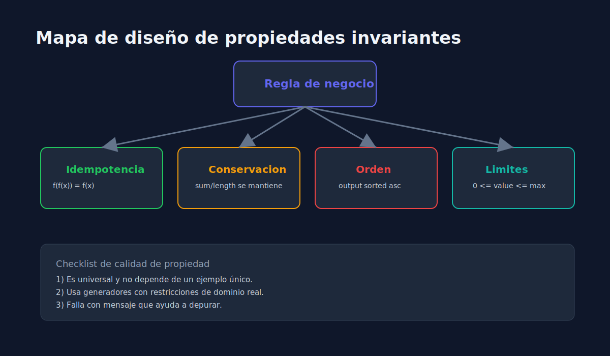
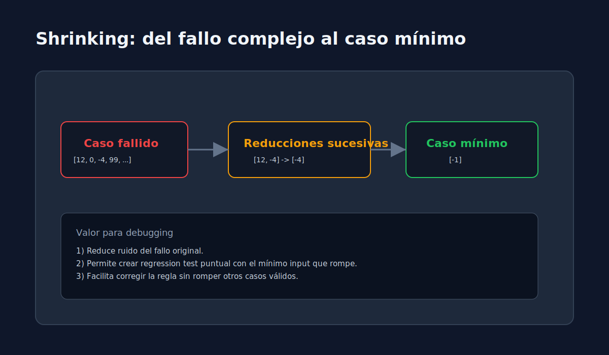

# 03 - Diseno de Propiedades con fast-check

> **Lenguaje:** JavaScript (Jest + fast-check)

---

## Objetivo

Definir propiedades que representen reglas de negocio reales y utiles.

---

## Checklist para una buena propiedad

1. Expresa una regla universal del dominio.
2. Tiene input generado con restricciones coherentes.
3. Tiene oraculo claro para validar salida.
4. Falla con mensaje interpretable.

---

## Patrones utiles

- Idempotencia: aplicar dos veces equivale a una.
- Conservacion: una magnitud se mantiene (ej. longitud, suma total).
- Orden: salida debe permanecer ordenada bajo criterio.
- Limites: resultado dentro de rango permitido.

---

## Recomendacion

Combina:

- tests de ejemplo para casos narrativos;
- propiedades para cobertura amplia de entradas.

Esto mejora confianza sin depender solo de snapshots o de ejemplos puntuales.
